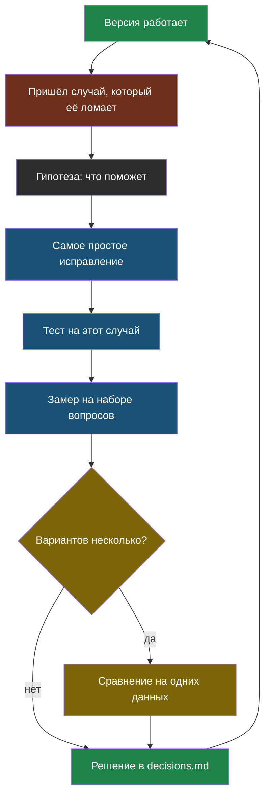

# Урок 1. Как устроен курс и первый запрос

> **Лабораторная модуля** — в [уроке 2](chapter-02.md): там мы напишем первого бота и поймаем его первый провал.

## Как устроен этот курс

Обычный курс устроен как справочник: вот API, вот RAG, вот агенты. Проблема в том, что после такого курса остаётся знание названий, а не умение выбирать.

Мы пойдём иначе. У нас есть одна программа — бот для сайта компании «Полярис», — и каждый модуль это её очередная версия. Модуль всегда начинается с того, что **предыдущая версия сломалась или упёрлась в предел**.



Смотри на стрелку из последнего узла обратно в первый: цикл не заканчивается. Каждая починка открывает следующую проблему — так выглядит настоящая разработка.

## Три файла, которые мы ведём с сегодня

Курс требует завести три файла и вести их до конца. Шаблоны лежат в папке `shablony/`.

| Файл | Что в нём | Зачем |
|---|---|---|
| `cases.jsonl` | каждый пойманный провал: вопрос, что не так, что ждём | чтобы одна и та же ошибка не вернулась |
| `tests/` | `pytest` по этим случаям | чтобы новая правка не сломала старое |
| `decisions.md` | «сравнили A, B, C → числа → взяли B, потому что…» | чтобы через месяц помнить, почему так |

> **Журнал решений** — файл, где каждое техническое решение записано вместе с числами, на которых оно принято, и условием, при котором его стоит пересмотреть.

Именно `decisions.md` — главный результат курса. Работающий бот напишут многие, а вот показать, какие варианты перепробованы и почему выбран этот, могут единицы. Заодно это готовый рассказ на собеседовании.

## Что такое языковая модель, в двух абзацах

> **Языковая модель** — программа, которая по началу текста предсказывает, каким будет продолжение, и делает это по одному кусочку за раз.

Она не ищет ответ в базе и не проверяет факты. Она подбирает **правдоподобное** продолжение того текста, который ей дали. Всё остальное в курсе — следствие этой одной фразы: и умение отвечать по документам, и выдумки, и способы их ловить.

Модель работает не с буквами и не со словами, а с токенами.

> **Токен** — кусочек текста, которым оперирует модель: часто это слово, часть слова или знак препинания. Русский текст дробится мельче английского: «ремонт» может стать двумя токенами, а «repair» — одним.

Токены важны по трём причинам: за них платят, от их количества зависит скорость и в них измеряется предел того, сколько текста модель может учесть за раз.

## Как выглядит запрос

Запрос к модели — это список сообщений. У каждого есть роль:

```python
messages = [
    {"role": "system", "content": "Ты помощник сервисного центра «Полярис». Отвечай кратко."},
    {"role": "user", "content": "До скольки вы работаете в субботу?"},
]
```

| Роль | Кто говорит | Что туда кладут |
|---|---|---|
| `system` | разработчик | правила: кто бот, как отвечает, чего не делает |
| `user` | пользователь | вопрос гостя |
| `assistant` | модель | её прошлые ответы, когда идёт диалог |

Роли — это подсказка модели, а не защита. Ничто не мешает модели нарушить то, что написано в `system`: это просто текст в начале, которому она обычно следует. Мы вернёмся к этому в уроке 2.

## Сколько это стоит

У модели два разных тарифа: за то, что она **прочитала**, и за то, что **написала**.

> **Цена входа и цена выхода** — плата за прочитанные и за написанные токены. Написанный токен обычно в 3–5 раз дороже прочитанного.

Считается просто: цена за миллион токенов умножается на количество токенов и делится на миллион. Сервер сам присылает в ответе, сколько токенов ушло на вход и на выход, — это поле `usage`, и в лаборатории мы будем печатать его на каждом шаге.

Порядок величин: дешёвая модель обходится в сотые доли цента за короткий ответ, сильная — в десятки раз дороже. Пока вопросов десять в день, разницы нет; на тысяче вопросов в день она превращается в реальные деньги. Поэтому в каждой лаборатории мы считаем цену.

## Почему ответ каждый раз разный

Модель выбирает следующий токен из нескольких правдоподобных. Насколько охотно она берёт менее вероятный вариант, задаёт температура.

> **Температура** — настройка разброса ответов: 0 означает «всегда бери самое вероятное продолжение», значения около единицы дают более разнообразный и менее предсказуемый текст.

Для справочного бота нужен предсказуемый ответ, поэтому дальше почти везде стоит `temperature=0`. Но и она не делает ответы одинаковыми навсегда: провайдер может обновить модель, и текст изменится.

## Что мы узнали

- Курс идёт по циклу «сломалось → гипотеза → исправление → тест → замер → решение», и цикл не заканчивается.
- Мы ведём **журнал случаев**, тесты и **журнал решений**; последний и есть главный результат курса.
- **Языковая модель** предсказывает правдоподобное продолжение текста, а не ищет факты.
- Запрос — список сообщений с ролями; правила в `system` — подсказка, а не защита.
- Платят отдельно за прочитанные и написанные **токены**; выход дороже входа.
- **Температура** управляет разбросом ответов; для справочного бота её ставят в 0.

## Проверь себя

1. Почему из фразы «модель предсказывает правдоподобное продолжение» следует, что она может уверенно ошибаться?
2. Чем роль `system` отличается от `user` и почему правила в `system` нельзя считать защитой?
3. Запрос — 200 токенов, ответ — 400. Цена входа $0,03 за миллион, выхода — $0,13. Сколько стоит тысяча таких запросов?
