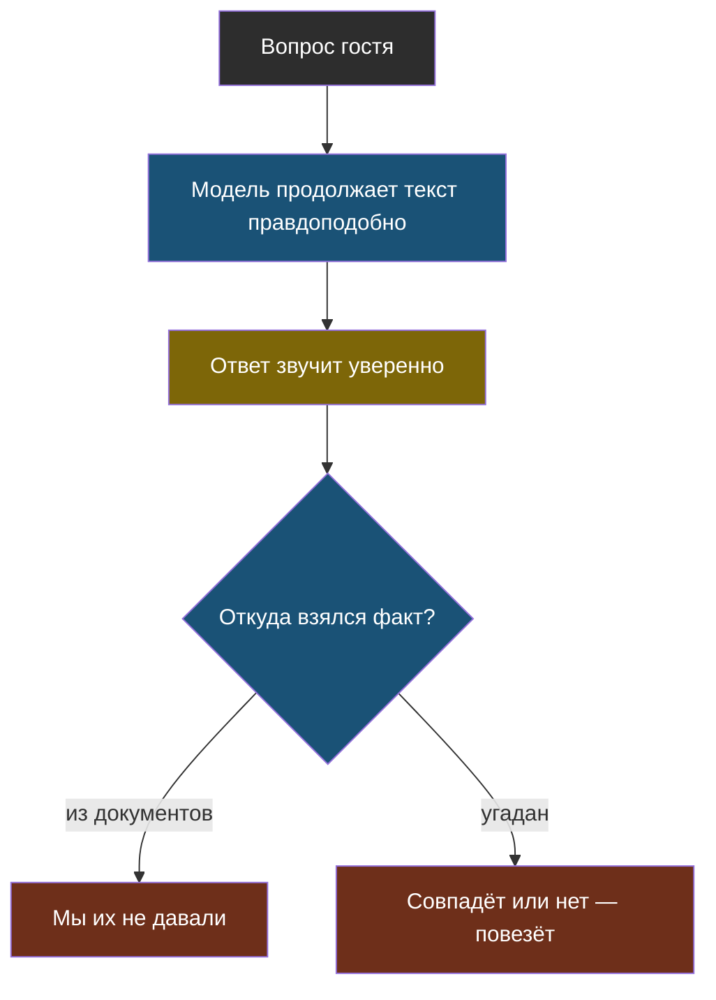

# Урок 2. Первый провал: бот уверенно выдумывает

> **Лабораторная модуля:** первый бот, его провал и первый замер.
> - [открыть в Google Colab](https://colab.research.google.com/github/iRoboTron/ai-docs-course/blob/main/docs/books/labs/modul1/01_pervyy_bot.ipynb) · [скачать .ipynb](labs/modul1/01_pervyy_bot.ipynb)
> - разобрана ниже, в разделе [«Что показала лабораторная»](#что-показала-лабораторная)

## Напомним, где мы остановились

Модель предсказывает правдоподобное продолжение текста. Запрос — список сообщений с ролями, правила лежат в `system`, за токены мы платим. Теперь напишем первую версию бота и посмотрим, что с ней не так.

## v1 целиком

Вот вся первая версия. Она принимает вопрос гостя и возвращает ответ:

```python
PRAVILA = (
    "Ты помощник сервисного центра «Полярис»: ремонт бытовой техники. "
    "Отвечай вежливо и коротко, максимум два предложения, на русском языке."
)

def bot_v1(vopros):
    otvet = client.chat.completions.create(
        model=MODEL, temperature=0, max_tokens=120,
        messages=[{"role": "system", "content": PRAVILA},
                  {"role": "user", "content": vopros}])
    return otvet.choices[0].message.content.strip()
```

Десять строк, и бот отвечает на любой вопрос. Выглядит как готовый продукт — ровно до того момента, когда мы сверим ответы с сайтом.

## Что показала лабораторная

Пять вопросов, которые каждый день задают настоящие гости. Ответы — от живой модели, прогон 16 сентября 2026 года на `qwen3.7-flash`:

| Вопрос гостя | Ответ v1 | На сайте «Поляриса» |
|---|---|---|
| Во сколько закрываетесь в субботу? | «работаем до 18:00» | до 17:00 |
| Какая гарантия на ремонт? | «12 месяцев» | 12 месяцев |
| Сколько стоит замена подшипников? | «зависит от модели, уточните» | от 4900 ₽ |
| Чините электросамокаты? | «не занимаемся, обратитесь в профильный сервис» | такой услуги нет |
| Диагностика платная? | «да, платная, зависит от техники» | 1200 ₽, бесплатно при ремонте |

Разберём это по-инженерному, а не «ну она ошиблась».

**Часы работы.** Ответ неверный, и по тону этого не видно. Гость приедет к 17:40 и увидит закрытую дверь.

**Гарантия.** Ответ совпал с сайтом — и это самый коварный случай. Модель не знала срок, она назвала типичный для отрасли. В соседней компании гарантия три месяца, и ответ был бы неверным — при той же уверенности.

> **Выдумка** (по-английски *галлюцинация*) — уверенный правдоподобный ответ, не основанный на фактах. Это не сбой, а прямое следствие того, как устроена модель: она продолжает текст, а не проверяет его.

**Электросамокаты.** Формально верно, но бот не сверялся со списком услуг: он просто продолжил фразу про «сервис бытовой техники». Добавит компания ремонт самокатов — бот продолжит отказывать.

**Цены и диагностика.** Уклончивый ответ вместо числа с сайта. Гость не узнал, сколько стоит, и всё равно звонит оператору — то есть бот не решил ни одной задачи.



Смотрите на ромб: у ответа есть ровно два источника, и первый мы боту не дали. Значит, каждый факт в его ответе — угаданный.

## Провал, который не записан, вернётся

Пять провалов мы нашли за десять минут. Через неделю мы вспомним два из них, через месяц — ни одного. Поэтому первое, что мы делаем, — заводим журнал случаев.

> **Журнал случаев** (`cases.jsonl`) — файл, где каждая пойманная ошибка записана как проверяемый случай: вопрос, ожидаемый ответ и чем плох текущий.

Одна строка — один случай:

```json
{"id": "subbota", "vopros": "Во сколько вы закрываетесь в субботу?", "zhdem": "17:00", "chto_ne_tak": "v1 ответила: до 18:00"}
{"id": "samokaty", "vopros": "Вы чините электросамокаты?", "zhdem": "не знаю", "chto_ne_tak": "v1 отвечает утвердительно, хотя списка услуг не видела"}
```

Обратите внимание на второй случай: там ожидается **отказ**. Набор, в котором у каждого вопроса есть ответ, воспитывает бота, который бойко отвечает на всё, включая то, чего не знает.

## Проверка вместо ощущений

Журнал сам по себе ничего не проверяет. Нужен прогон: задать боту все вопросы и посчитать, сколько ответов верны.

Сравнивать дословно нельзя — модель каждый раз формулирует иначе. Поэтому проверяем по существу: если ждём факт, он должен встретиться в ответе; если ждём отказ, в ответе не должно быть утверждения.

```python
def proverit(otvet, zhdem):
    if zhdem == "не знаю":
        return "не зна" in otvet.lower() or "уточните" in otvet.lower()
    return zhdem.lower() in otvet.lower()
```

Такая проверка грубая: ответ «гарантия не 12 месяцев, а 3» её пройдёт. Мы вернёмся к этому в модуле 6, когда будем всерьёз мерить качество. Но даже грубая проверка даёт то, чего не даёт ощущение: **число**.

Первый замер v1: **1 из 5**. И единственный зелёный ответ — та самая угаданная гарантия. По сути бот не знает ничего.

## Попытка починить одной строкой

Первое, что приходит в голову: попросить модель не выдумывать. Это дёшево, поэтому попробовать нужно обязательно — и так же обязательно замерить.

```python
PRAVILA_STROGIE = PRAVILA + (
    " Отвечай только тем, что знаешь про этот сервисный центр наверняка. "
    "Если не знаешь точно, ответь «Не знаю, уточните у оператора»."
)
```

Результат прогона: бот ответил **«Не знаю, уточните у оператора» на все пять вопросов**. Счёт остался 1 из 5, только теперь зелёный — вопрос про самокаты, а угаданная гарантия стала «не знаю».

| | v1 | v1.1 с просьбой |
|---|---|---|
| Верных ответов | 1 из 5 | 1 из 5 |
| Неверных фактов | 4 | 0 |
| Полезных ответов | 1 (случайно) | 0 |

Что из этого следует:

1. **Выдумки исчезли.** Гость больше не приедет к закрытой двери — это настоящее улучшение, пусть число и не выросло.
2. **Знаний не прибавилось.** Просьба может заставить модель молчать, но не может рассказать ей про «Полярис».
3. **Бот стал бесполезным.** Гость, которому на всё отвечают «уточните у оператора», просто позвонит сам.

> **Просьба — не источник знаний.** Правилами можно задать тон и осторожность. Факты надо **класть в запрос**.

## Найди ошибку

Разработчик увидел, что бот путает часы работы, и решил проблему так:

```python
PRAVILA = (
    "Ты помощник сервисного центра «Полярис». "
    "Мы работаем по будням с 9:00 до 20:00, в субботу с 10:00 до 17:00. "
    "Гарантия на работы 12 месяцев. Отвечай кратко."
)
```

Часы работы бот теперь называет правильно. Что не так с этим решением?

<details>
<summary>Ответ</summary>

Как временная мера это нормально и даже правильно: факты попали в запрос, и бот отвечает верно. Проблемы начинаются дальше.

1. **Не масштабируется.** На сайте пять страниц, а фактов — сотни: цены по всем видам техники, сроки, условия гарантии, стоимость курьера. Всё это в правила не поместится, а если поместится, то каждый запрос будет их оплачивать.
2. **Устареет молча.** Компания поменяет цену — правила останутся прежними. Никто не заметит, пока не пожалуется клиент.
3. **Правила нельзя проверить.** Нет ответа на вопрос «откуда бот это взял»: факт растворён в тексте правил.

Правильное направление — не вписывать факты руками, а **давать боту документы** и требовать отвечать только по ним. Первый шаг к этому — модуль 3, где мы сложим в запрос весь сайт целиком и посмотрим, где это перестанет работать.
</details>

## Что мы узнали

- Первая версия бота пишется за десять строк и **выглядит** работающей.
- Все факты в её ответах — угаданные: документов мы ей не давали.
- Совпавший с правдой ответ (гарантия) опаснее явно неверного: он создаёт ложное доверие.
- **Журнал случаев** превращает пойманный провал в проверяемый случай, а прогон — в число.
- Просьба «не выдумывай» убирает выдумки, но не добавляет знаний: 1 из 5 осталось 1 из 5.

## Проверь себя

1. Почему ответ «гарантия 12 месяцев», совпавший с сайтом, всё равно считается провалом?
2. Зачем в журнале случаев нужны вопросы, на которые правильный ответ — «не знаю»?
3. Просьба «не выдумывай» убрала неверные факты, но число верных ответов не выросло. Почему одно не следует из другого?

## Что добавилось в сервис

- **v1** — бот, который отвечает на вопросы гостя (и почти всегда неверно).
- **`cases.jsonl`** — пять случаев, с которых начинается эталонный набор.
- **Прогон по случаям** — первая проверка и первое число: 1 из 5.
- **`decisions.md`** — первая запись: просьбу «не выдумывай» оставляем, задача не решена.

## Итог модуля 1

У нас есть работающая программа, честное число её качества и понимание, чего ей не хватает: фактов. В модуле 2 мы разберёмся, почему она к тому же падает, — и научимся переживать ошибки сети, лимиты и ответы не в том формате.
