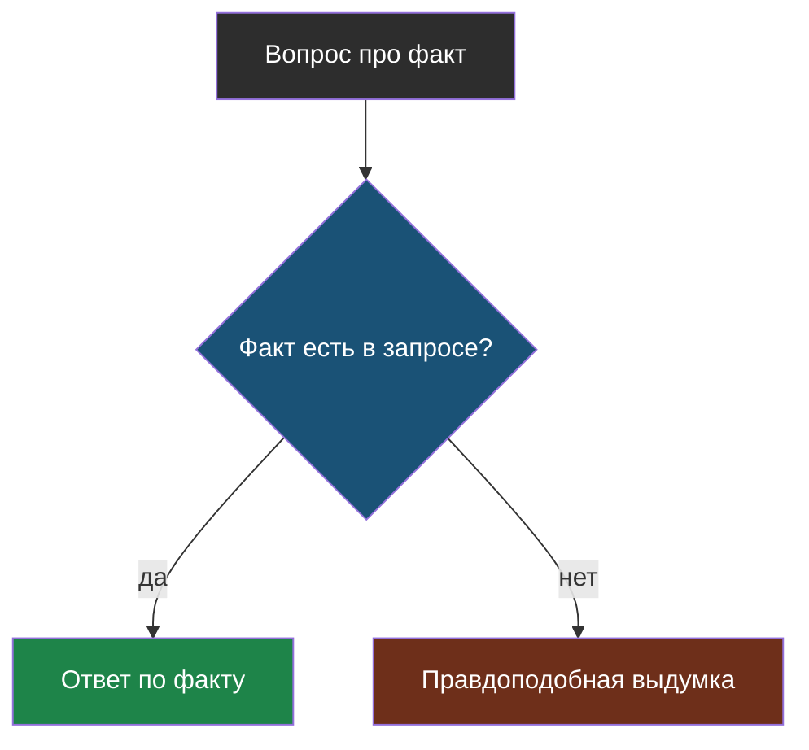
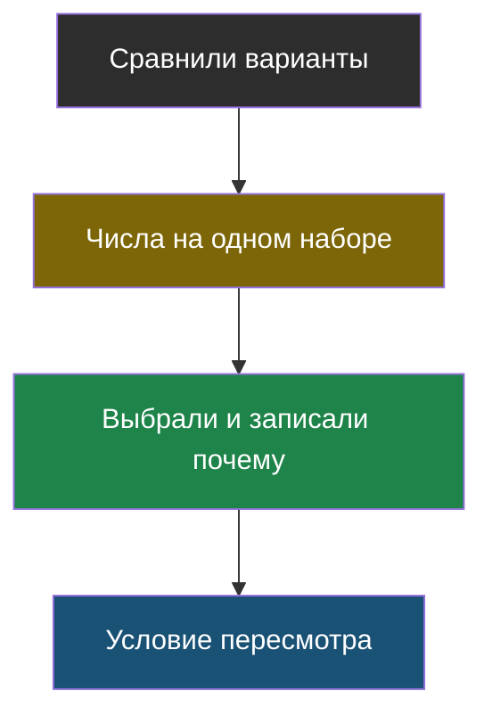
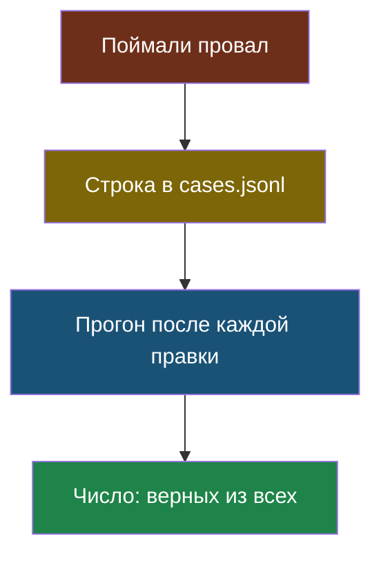
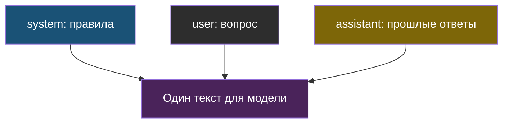
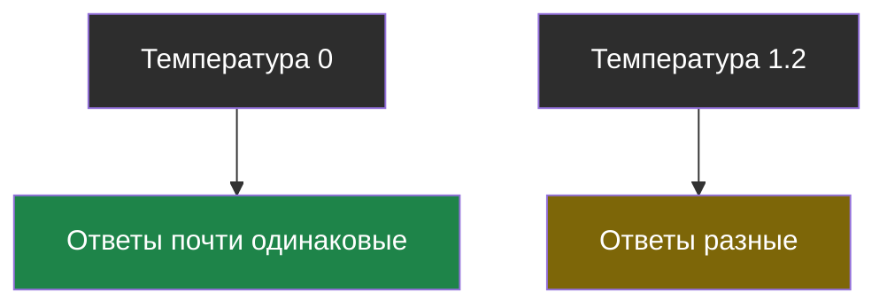
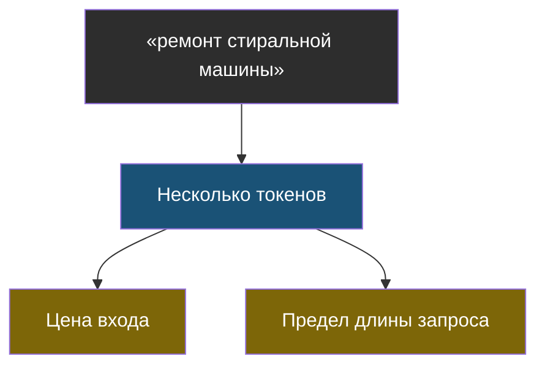
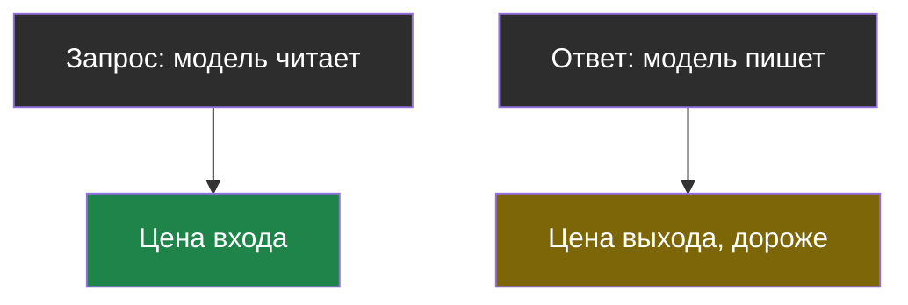
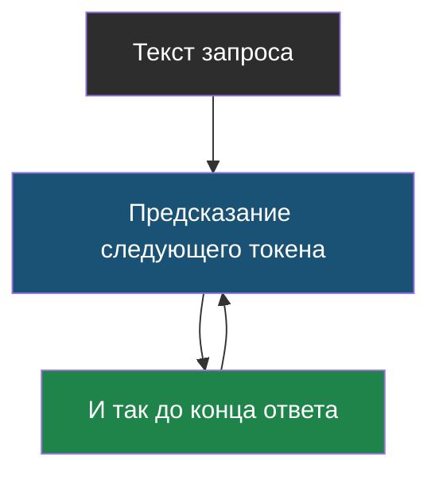

# Словарик модуля 1

Термины по алфавиту; названия латиницей — в конце.

## Выдумка (галлюцинация)

> **Выдумка** — уверенный правдоподобный ответ, не основанный на фактах. Это не сбой, а следствие того, как устроена модель: она продолжает текст, а не проверяет его.

Из [урока 2](chapter-02.md). Совпавшая с правдой выдумка опаснее явно неверной.

## Журнал решений

> **Журнал решений** — файл, где каждое техническое решение записано вместе с числами, на которых оно принято, и условием, при котором его стоит пересмотреть.

Из [урока 1](chapter-01.md). Главный результат курса.

## Журнал случаев

> **Журнал случаев** (`cases.jsonl`) — файл, где каждая пойманная ошибка записана как проверяемый случай: вопрос, ожидаемый ответ и чем плох текущий.

Из [урока 2](chapter-02.md). В наборе обязательно есть случаи, где правильный ответ — «не знаю».

## Роли сообщений

> **Роли сообщений** — пометки, кто говорит: `system` — правила от разработчика, `user` — вопрос пользователя, `assistant` — прошлые ответы модели.

Из [урока 1](chapter-01.md). Правила в `system` — подсказка, а не защита.

## Температура

> **Температура** — настройка разброса ответов: 0 означает «бери самое вероятное продолжение», значения около единицы дают более разнообразный и менее предсказуемый текст.

Из [урока 1](chapter-01.md). Ноль не гарантирует дословного повтора и не спасает от выдумок.

## Токен

> **Токен** — кусочек текста, которым оперирует модель: слово, часть слова или знак препинания. Русский текст дробится мельче английского.

Из [урока 1](chapter-01.md). В токенах считают цену, скорость и предел длины запроса.

## Цена входа и цена выхода

> **Цена входа и цена выхода** — плата за прочитанные и за написанные токены. Написанный токен обычно в 3–5 раз дороже прочитанного.

Из [урока 1](chapter-01.md). Сервер присылает число токенов в поле `usage`.

## Языковая модель

> **Языковая модель** — программа, которая по началу текста предсказывает продолжение и делает это по одному кусочку за раз.

Из [урока 1](chapter-01.md). Она не ищет ответ в базе и не проверяет факты.

