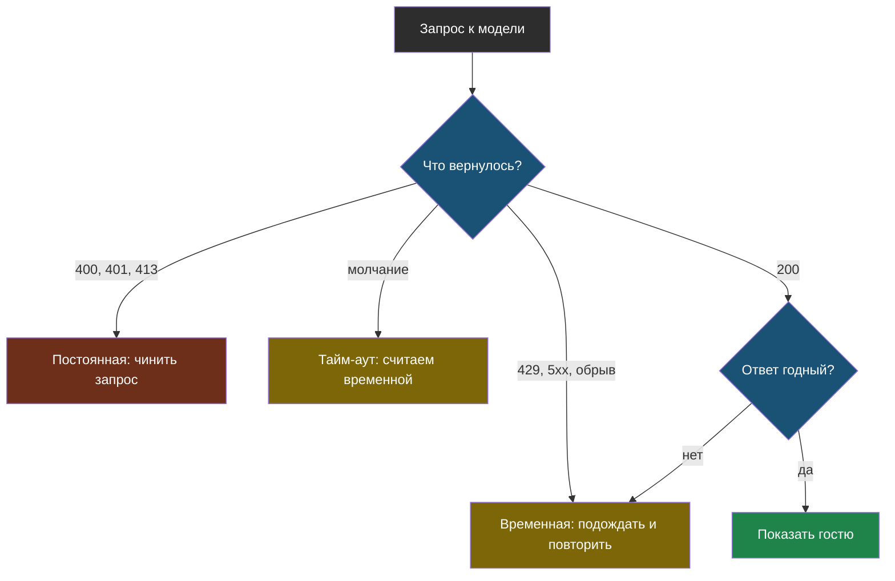

# Урок 1. Что ломается по дороге

> **Лабораторной в этом уроке нет.** Практика модуля — в [уроке 2](chapter-02.md).

## Напомним, где мы остановились

v1 отвечает на вопросы гостей и почти всегда неверно: фактов о компании у неё нет. Мы завели журнал случаев и получили первое число — 1 из 5. Прежде чем давать боту знания, разберёмся, почему он вообще перестаёт отвечать.

## Запрос идёт по сети

Между вашим кодом и моделью — интернет, балансировщик провайдера, очередь на видеокартах и сама модель. Сломаться может каждый участок, и у каждой поломки свой вид.

Сервер отвечает **кодом**: три цифры, которые говорят, что случилось.

| Код | Что значит | Пример | Пройдёт само? |
|---|---|---|---|
| **400** | запрос составлен неправильно | неизвестная модель, неверный параметр | нет |
| **401** | не узнали, кто вы | неверный или просроченный ключ | нет |
| **413** | запрос слишком большой | отправили целую книгу | нет |
| **429** | слишком часто | упёрлись в лимит провайдера | да, если подождать |
| **500, 502, 503** | сломалось на той стороне | модель перегружена | обычно да |

Правило для памяти: коды на **4** — обычно наша вина, коды на **5** — их. И отдельно 429: запрос правильный, просто пришёл не вовремя.

> **Временная ошибка** — отказ, который может пройти сам: перегрузка сервиса, лимит частоты, обрыв сети.

> **Постоянная ошибка** — отказ из-за самого запроса: неверный параметр, ключ, слишком длинный текст. Повтор того же запроса даст ту же ошибку.

Различие не теоретическое. Повторять постоянную ошибку — значит впустую тратить время пользователя, лимит запросов и деньги.



Обратите внимание на правую ветку: даже код 200 попадает на проверку. Почему — ниже.

## Тайм-аут: когда ответа просто нет

Сервис может не ответить ошибкой, а молчать. У библиотеки `openai` предел ожидания по умолчанию — минуты, и всё это время пользователь смотрит в пустой экран.

> **Тайм-аут** — предельное время ожидания ответа, после которого программа перестаёт ждать и считает запрос неудачным.

Как выбрать: посмотрите, за сколько модель обычно отвечает, и возьмите с запасом в три–пять раз. Отвечает за 2 секунды — ставьте 10–15.

## Успех, который не успех

Самые неприятные сбои приходят с кодом 200.

**Ответ оборван.** Модель упёрлась в `max_tokens`, в ответе `finish_reason: length`. Текст обрывается на полуслове, а JSON без закрывающей скобки не разбирается вовсе.

**Ответ пустой.** Некоторые модели иногда возвращают пустой текст — например, если потратили весь лимит на внутренние рассуждения.

**Ответ не того вида.** Просили JSON — пришёл JSON, обёрнутый в пояснения. Просили одно слово — пришёл абзац.

Для пользователя разницы нет: и красная ошибка, и мусор в ответе — это «бот сломался». Поэтому проверять нужно не только код, но и содержимое.

## Почему `except Exception: pass` — плохая идея

Первое, что хочется написать:

```python
while True:
    try:
        return sprosit_model(vopros)
    except Exception:
        pass
```

Три беды в четырёх строках:

| Беда | Чем кончится |
|---|---|
| нет лимита попыток | неверный ключ — программа повторяет вечно |
| нет паузы | сервис перегружен, а мы добиваем его сотней запросов в секунду |
| ловим всё подряд | опечатка в своём коде (`NameError`) тоже «повторяется», и её не видно |

Правильный повтор — с лимитом, с растущей паузой и **только для временных ошибок**. Этим займёмся в уроке 2.

## Что мы узнали

- Сервер отвечает кодом: на **4** — обычно ошибка в запросе, на **5** — на той стороне, **429** — слишком часто.
- **Временную** ошибку имеет смысл повторить, **постоянную** — нет.
- Без **тайм-аута** программа может ждать минуту; выбирают его с запасом от обычного времени ответа.
- Код 200 не гарантирует годный ответ: бывает обрыв, пустота и не тот формат.
- Ловить все исключения подряд в цикле повторов опасно: так прячутся ошибки в собственном коде.

## Проверь себя

1. Какие из ошибок 400, 429, 503 имеет смысл повторять и почему?
2. Ответ пришёл с кодом 200 и `finish_reason: length`. Что это значит и поможет ли повтор того же запроса?
3. Как выбрать тайм-аут, не гадая?
