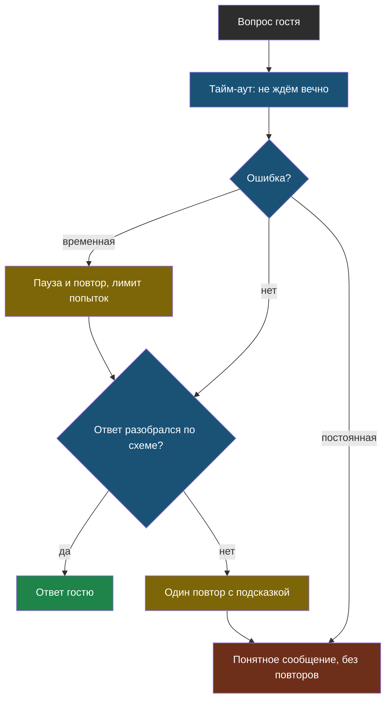

# Урок 2. v2: повторы, схема ответа, поток

> **Лабораторная модуля:** ломаем бота пятью способами и учим его переживать поломки.
> - [открыть в Google Colab](https://colab.research.google.com/github/iRoboTron/ai-docs-course/blob/main/docs/books/labs/modul2/01_ne_padat.ipynb) · [скачать .ipynb](labs/modul2/01_ne_padat.ipynb)
> - результаты разобраны ниже, в разделе [«Что показала лабораторная»](#что-показала-лабораторная)

## Напомним, где мы остановились

Ошибки бывают временные и постоянные, тайм-аут нужен всегда, а код 200 не гарантирует годного ответа. Теперь соберём из этого v2.

## Повтор, который не делает хуже

```python
def s_povtorami(sdelat_zapros, popytok=4, pauza=1.0):
    for popytka in range(1, popytok + 1):
        try:
            return sdelat_zapros()
        except Exception as oshibka:
            vid, _ = razobrat(oshibka)
            if vid != "временная" or popytka == popytok:
                raise
            time.sleep(pauza * random.uniform(0.5, 1.5))
            pauza *= 2
```

Здесь три решения, и каждое стоит объяснить.

> **Повтор с растущей паузой** (по-английски *exponential backoff*) — повтор неудачного запроса, при котором пауза перед каждой следующей попыткой вдвое длиннее предыдущей, а число попыток ограничено.

**Лимит попыток.** Цикл обязан заканчиваться. Без лимита неверный ключ превращается в бесконечное «подождите».

**Пауза растёт.** Сервис отвечает 503, потому что перегружен. Если все клиенты повторят через 100 мс, станет только хуже. Растущая пауза даёт сервису шанс разгрузиться.

**Разброс паузы.** Если у всех клиентов сбой случился одновременно и все ждут ровно секунду, они снова придут одновременно. Множитель от 0,5 до 1,5 их расталкивает.

## Как проверить защиту, если сбоев нет

Настоящие 503 случаются редко. Чтобы проверить повторы, сбои устраивают нарочно.

> **Обезьяна** — обёртка, которая с заданной вероятностью притворяется, что сервис ответил ошибкой. Так проверяют устойчивость, не дожидаясь настоящей аварии.

В лабораторной обезьяна ломает половину запросов, и видно, как повторы вытаскивают ответ со второй-третьей попытки.

## Ответ, который можно проверить

Вторая проблема v1 — ответ свободным текстом. Программа не может понять из него, уверен бот или сочиняет.

Попросим модель отвечать структурой и проверим её библиотекой `pydantic`:

```python
class OtvetBota(BaseModel):
    otvet: str
    uveren: bool
    chego_ne_hvataet: str | None = None
```

> **Ответ по схеме** — режим, когда модель возвращает JSON заданного вида, а программа проверяет его по описанию полей и получает объект вместо текста.

Две части здесь равноправны: **просьба** (параметр `response_format` и описание полей в правилах) и **проверка** (`pydantic`). Просьба без проверки ничего не гарантирует — модель может вернуть JSON в обёртке из пояснений.

Если формат всё же сломан, помогает **один** повтор с подсказкой: показать модели её ответ и сказать, что не так. Бесконечно повторять нельзя — если и второй ответ негодный, честнее отказать.

## Поток: не быстрее, но приятнее

```python
potok = client.chat.completions.create(..., stream=True)
for kusok in potok:
    print(kusok.choices[0].delta.content or "", end="", flush=True)
```

> **Потоковый ответ** — режим, в котором модель отдаёт текст кусочками по мере написания. Полное время то же, но первые слова видны почти сразу.

В лабораторной первый кусочек пришёл через 1,05 секунды, весь ответ — через 1,75. Для гостя на сайте это разница между «бот завис» и «бот печатает».

Кусочки нарезаны как попало, границы слов не соблюдаются. Поэтому JSON по кусочкам не разбирают: сначала собирают текст целиком. Для ответов, которые читает программа, поток просто не нужен.

## Слои защиты



Каждый слой ловит своё, и у любого пути есть конец: либо проверенный ответ, либо понятное сообщение. Красный узел — это не провал, а честный отказ: он гораздо лучше Traceback на экране гостя.

## Что показала лабораторная

Прогон 16 сентября 2026 года на `qwen3.7-flash`.

**Пять поломок выглядят так:**

| Что сломали | Тип в Python | Код | Вид |
|---|---|---|---|
| несуществующая модель | `BadRequestError` | 400 | постоянная |
| неверный ключ | `AuthenticationError` | 401 | постоянная |
| запрос на 72 000 символов | `APIStatusError` | 413 | постоянная |
| тайм-аут 0,5 с | `APITimeoutError` | — | временная |
| `max_tokens=12` | успех, `finish_reason=length` | 200 | негодный ответ |

Последняя строка — та самая ловушка: зелёная галочка, а JSON обрывается на середине слова и не разбирается.

**Повторы работают:** постоянная ошибка отвергается с первой попытки, а обезьяна, ломавшая половину запросов, отняла максимум две дополнительные попытки и паузу меньше секунды.

**Замер на журнале случаев:**

| | v1 | v2 |
|---|---|---|
| Верных ответов | 1 из 5 | 1 из 5 |
| Падений на ошибках | сколько угодно | 0 |
| Ответ пригоден для программы | нет | да |

Число верных ответов не выросло — и это правильный результат. Мы чинили надёжность, а не знания: фактов о «Полярисе» у бота по-прежнему нет.

## Главная находка: «уверен» — это не «правда»

В схеме есть поле `uveren`, и была надежда использовать его как проверку: неуверенный ответ не показывать. Прогон эту надежду убил.

На вопрос про субботу бот ответил «Мы работаем до 18:00» (на сайте 17:00) и поставил **`uveren: true`**. Отказов почти не было — модель считает, что знает.

> **Самооценка модели не заменяет проверку.** Поле «уверен» говорит о тоне ответа, а не о наличии данных.

Это тот же вывод, что в модуле 1 про просьбу «не выдумывай», только с другой стороны: **что бы мы ни спрашивали у модели о ней самой, знаний это не добавит**. Нужны документы — ими займёмся в модуле 3.

## Найди ошибку

Разработчик обернул все вызовы модели так:

```python
def nadezhno(vopros):
    for popytka in range(5):
        try:
            return sprosit_model(vopros)
        except Exception:
            time.sleep(2)
    return "Ошибка"
```

Найдите три проблемы.

<details>
<summary>Ответ</summary>

1. **Повторяются постоянные ошибки.** Неверный ключ (401) даст пять попыток и десять секунд ожидания вместо мгновенного честного сообщения.
2. **Ловится всё подряд.** Опечатка в коде (`NameError`) тоже «повторяется», и разработчик её не увидит: вместо падения он получит строку «Ошибка».
3. **Пауза фиксированная и без разброса.** Сервис перегружен — мы стучим ровно каждые две секунды; если клиентов много, они стучат синхронно.
4. Бонус: **«Ошибка»** ничего не говорит ни гостю, ни разработчику. Понятное сообщение зависит от вида сбоя: «сервис перегружен, попробуйте через минуту» или «сообщите администратору».
</details>

## Что мы узнали

- **Повтор с растущей паузой** нужен только для временных ошибок: с лимитом попыток и разбросом паузы.
- **Обезьяна** позволяет проверить устойчивость, не дожидаясь настоящей аварии.
- **Ответ по схеме** делает ответ пригодным для программы: просьба плюс проверка `pydantic`.
- **Потоковый ответ** не ускоряет модель, но убирает ощущение зависшего бота.
- Самооценка модели (`uveren`) не является проверкой: она была `true` на выдуманном ответе.

## Проверь себя

1. Почему паузе перед повтором нужен случайный разброс?
2. Схема ответа гарантирует, что придёт JSON с нужными полями. Что она не гарантирует?
3. Бот возвращает оценку в JSON, которую программа кладёт в таблицу. Нужен ли здесь потоковый ответ?

## Что добавилось в сервис

- **v2** — тайм-аут, повторы только для временных ошибок, ответ по схеме, понятные сообщения вместо Traceback.
- **Обезьяна** — способ проверять устойчивость.
- **`decisions.md`** — запись: v2 принят, падений 0, знаний не прибавилось.
- **`antipatterns.md`** — «`except Exception: pass` в цикле повторов» и «поле `uveren` как проверка».

## Итог модуля 2

Бот больше не падает и отвечает структурой, которую можно проверить. Но он по-прежнему не знает о компании ничего. В модуле 3 мы дадим ему самый простой источник знаний: положим **весь сайт целиком** в каждый запрос — и посмотрим, где это перестанет работать.
