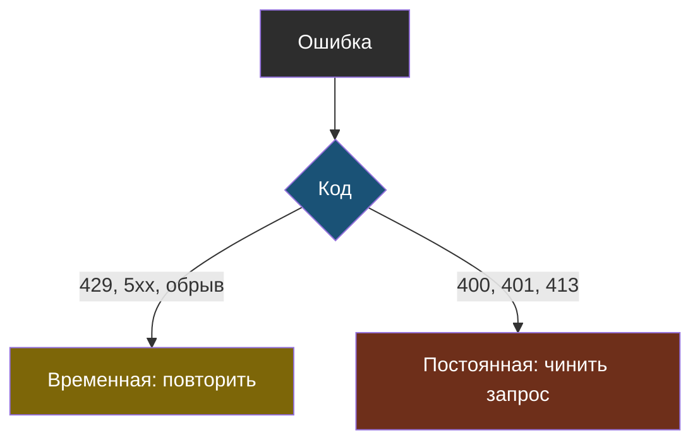
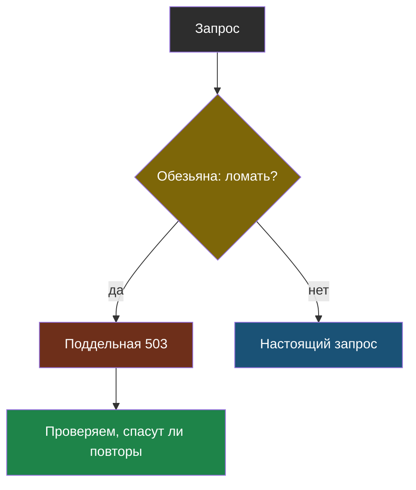
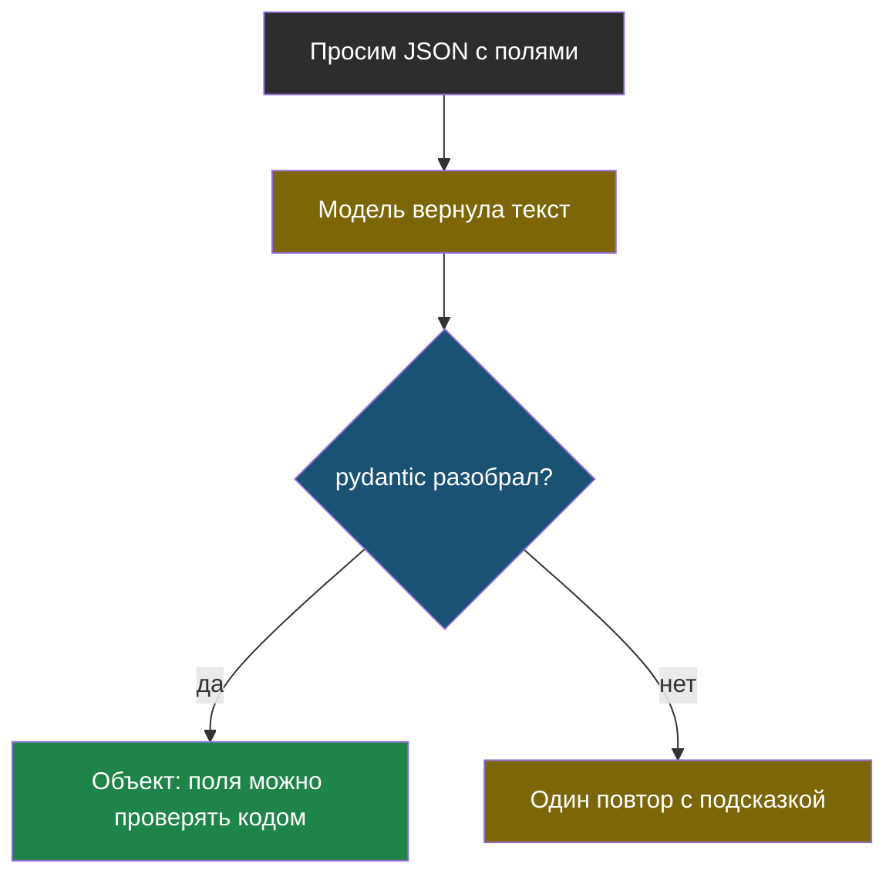
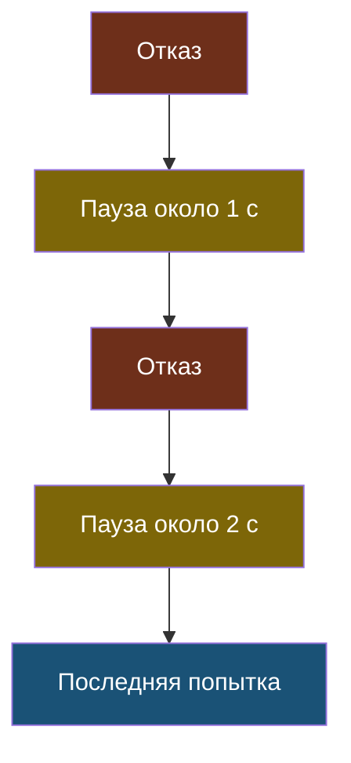
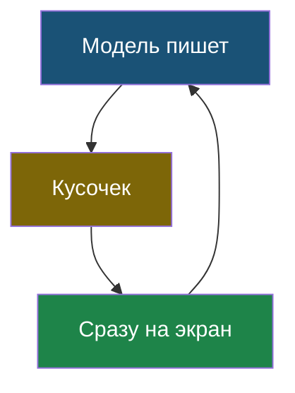
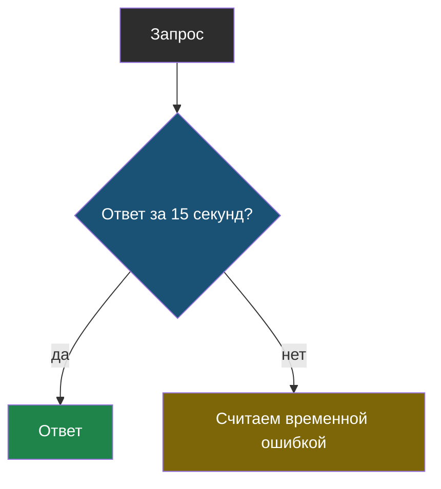

# Словарик модуля 2

Термины по алфавиту; названия латиницей — в конце.

## Временная и постоянная ошибка

> **Временная ошибка** — отказ, который может пройти сам: перегрузка сервиса (5xx), лимит частоты (429), обрыв сети. **Постоянная ошибка** — отказ из-за самого запроса (400, 401, 413); повтор даст тот же результат.

Из [урока 1](chapter-01.md). Повторять постоянную ошибку — тратить время и деньги.

## Обезьяна

> **Обезьяна** — обёртка, которая с заданной вероятностью притворяется, что сервис ответил ошибкой. Так проверяют устойчивость, не дожидаясь настоящей аварии.

Из [урока 2](chapter-02.md).

## Ответ по схеме

> **Ответ по схеме** — режим, когда модель возвращает JSON заданного вида, а программа проверяет его по описанию полей и получает объект вместо текста.

Из [урока 2](chapter-02.md). Просьба без проверки ничего не гарантирует.

## Повтор с растущей паузой

> **Повтор с растущей паузой** (по-английски *exponential backoff*) — повтор неудачного запроса, при котором пауза перед каждой следующей попыткой вдвое длиннее предыдущей, а число попыток ограничено.

Из [урока 2](chapter-02.md). Паузе нужен случайный разброс.

## Потоковый ответ

> **Потоковый ответ** — режим, в котором модель отдаёт текст кусочками по мере написания. Полное время то же, но первые слова видны почти сразу.

Из [урока 2](chapter-02.md). Для ответов, которые читает программа, не нужен.

## Тайм-аут

> **Тайм-аут** — предельное время ожидания ответа, после которого программа перестаёт ждать и считает запрос неудачным.

Из [урока 1](chapter-01.md). Берут с запасом в 3–5 раз от обычного времени ответа.

