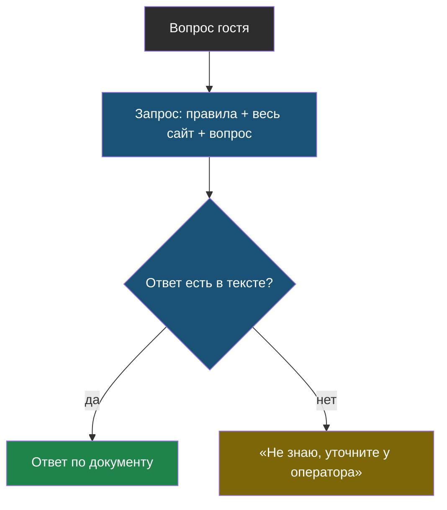

# Урок 1. Грунтование: дать модели факты

> **Лабораторной в этом уроке нет.** Практика модуля — в [уроке 2](chapter-02.md).

## Напомним, где мы остановились

Два модуля мы пытались добиться правильных ответов, ничего не давая боту: просили «не выдумывать», требовали структуру, спрашивали, уверен ли он. Результат не менялся: 1 из 5. Причина простая — фактов у модели нет, и получить их из воздуха она не может.

## Единственный честный способ

> **Грунтование** (по-английски *grounding*) — приём, при котором в запрос кладут нужные документы и требуют отвечать только по ним. Ответ «заземляется» на данные, которые вы дали сами.

Разница с просьбой «не выдумывай» принципиальная:

| Просьба | Грунтование |
|---|---|
| «Отвечай только то, что знаешь точно» | «Вот текст, отвечай только по нему» |
| Модель решает сама, что она «знает» | Источник виден и лежит перед ней |
| Проверить нечем | Можно проверить, есть ли ответ в тексте |
| Не помогло: 1 из 5 | Помогло: 5 из 5 |

Запрос при этом выглядит так:

```python
PRAVILA = """Ты помощник сервисного центра «Полярис».
Отвечай ТОЛЬКО по тексту из блока ДАННЫЕ САЙТА.
Если ответа там нет — ответь ровно: «Не знаю, уточните у оператора».

ДАННЫЕ САЙТА:
""" + ves_sayt
```

Три части этого правила делают разную работу, и все три нужны:

1. **«Только по тексту»** — запрещает пользоваться общими знаниями модели.
2. **Явный блок с данными** — отделяет факты от инструкций, чтобы модель не путала одно с другим.
3. **Готовая фраза для отказа** — даёт модели выход, когда ответа в тексте нет. Без него она начнёт выкручиваться и выдумывать.



Жёлтый узел — не провал, а правильное поведение. Отказ, основанный на документе, честнее уверенной выдумки.

## Почему теперь отказ стал осмысленным

В модуле 1 бот отказался чинить электросамокаты — и это было угадывание: списка услуг он не видел. Теперь отказ означает другое: «я посмотрел в данные сайта, там такой услуги нет».

Разница видна, когда компания меняется. Добавят ремонт самокатов на сайт — v3 сразу начнёт отвечать «да», и никто не будет править правила.

## Где предел

У решения «весь сайт в запросе» два ограничения, и оба жёсткие.

**Контекстное окно.**

> **Контекстное окно** — предел того, сколько токенов модель может принять за один запрос. Всё, что не влезло, отправить нельзя.

У современных моделей окно большое: сотни тысяч токенов. Сайт из пяти страниц занимает около тысячи — кажется, что запас бесконечный. Но документация компании, база знаний поддержки или архив договоров съедают его быстро.

**Цена.** Вот это ограничение бьёт раньше. Каждый вопрос оплачивает весь текст заново, даже если гость спросил «во сколько вы работаете». Считать это нужно не когда придёт счёт, а сразу — в уроке 2 мы посчитаем.

## Что мы узнали

- **Грунтование** — дать модели документы и требовать отвечать только по ним; это единственный честный способ получить верные факты.
- Правило грунтования состоит из трёх частей: «только по тексту», явный блок данных и готовая фраза для отказа.
- Отказ, основанный на документе, отличается от угадывания: он меняется вместе с документом.
- У решения «весь сайт в запросе» два предела: **контекстное окно** и цена, и цена наступает раньше.

## Проверь себя

1. Чем грунтование отличается от просьбы «отвечай только то, что знаешь точно»?
2. Зачем в правилах нужна готовая фраза для отказа, если можно просто запретить выдумывать?
3. Почему цена ограничивает решение «весь сайт в запросе» раньше, чем контекстное окно?
