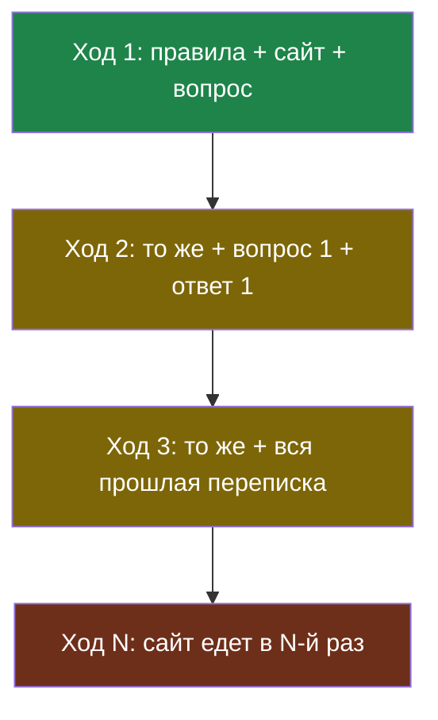

# Урок 2. Цена решения и память диалога

> **Лабораторная модуля:** весь сайт в запросе, замер цены по размеру сайта и по длине разговора.
> - [открыть в Google Colab](https://colab.research.google.com/github/iRoboTron/ai-docs-course/blob/main/docs/books/labs/modul3/01_vsya_spravka.ipynb) · [скачать .ipynb](labs/modul3/01_vsya_spravka.ipynb)
> - числа разобраны ниже, в разделе [«Что показала лабораторная»](#что-показала-лабораторная)

## Напомним, где мы остановились

Грунтование сработало: бот отвечает по документам, а отказ стал осмысленным. Теперь посчитаем, во что это обходится, и добавим второй источник расходов — диалог.

## За что мы платим

В запросе v3 три части, и они очень разные по размеру:

| Часть запроса | Размер | Меняется от вопроса к вопросу? |
|---|---|---|
| Правила бота | ~50 токенов | нет |
| Весь сайт | ~900 токенов (5 страниц) | нет |
| Вопрос гостя | ~6 токенов | да |

Полезная часть — шесть токенов из тысячи. Всё остальное мы пересылаем заново на каждом вопросе, потому что модель ничего не помнит между запросами.

Дальше арифметика простая: вдвое больше страниц — вдвое дороже **каждый** вопрос. Не разово, а всегда.

## Диалог: вторая утечка

Гость редко задаёт один вопрос. Он уточняет, переспрашивает, возвращается к началу. Чтобы бот понимал, о чём речь, программа пересылает всю переписку заново.

> **История диалога** — все прошлые сообщения, которые отправляются модели вместе с новым вопросом, потому что сама модель между запросами ничего не помнит.

Получается, что на пятом ходе мы платим за сайт **плюс** за четыре прошлых вопроса и ответа. Чем дольше разговор, тем дороже каждый следующий ход.



Смотрите на нижний узел: главный расход — не история, а сайт, который едет в каждом запросе целиком.

## Два способа укротить историю

> **Скользящее окно** — приём, при котором модели отправляют только несколько последних сообщений диалога, а более старые не отправляют вовсе.

Дёшево и в одну строку: `istoriya[-4:]`. Беда в том, что выпавшее забыто навсегда: гость спрашивает «так что там с моей поломкой», а бот уже не знает, о чём он.

> **Пересказ истории** — приём, при котором старая часть диалога заменяется коротким изложением, которое пишет сама модель.

Память сохраняется, но за отдельный запрос: пересказ тоже стоит денег и времени. И пересказывает модель — значит, может что-то потерять.

Что выбрать, зависит от того, есть ли в начале разговора важное. Для справочного бота на сайте, где вопросы короткие и независимые, окна обычно хватает.

## Что показала лабораторная

Прогон 16 сентября 2026 года на `qwen3.7-flash`, сайт из пяти страниц.

**Замер на журнале случаев:**

| Версия | Верных ответов |
|---|---|
| v1: просто спрашиваем модель | 1 из 5 |
| v2: надёжность и схема ответа | 1 из 5 |
| **v3: весь сайт в запросе** | **5 из 5** |

Вот ради этого и был весь модуль: задача решена, все пять вопросов гостей получили верные ответы, а на вопрос про электросамокаты бот честно ответил «Не знаю, уточните у оператора».

**Цена одного вопроса:** вход 955 токенов, из них на вопрос приходится около шести. Один вопрос стоит $0,000032, десять тысяч вопросов — 32 цента. На дешёвой модели это копейки; на сильной, которая дороже примерно в сто раз, те же десять тысяч вопросов стоят уже больше тридцати долларов.

**Рост сайта:**

| Страниц | Вход, токенов | Цена вопроса | Ответ верный |
|---|---|---|---|
| 5 | 961 | $0,000032 | да |
| 10 | 1818 | $0,000058 | да |
| 20 | 3532 | $0,000110 | да |
| 30 | 5246 | $0,000161 | да |

Ответ остаётся верным — проблема не в качестве, а в том, что цена растёт вместе с сайтом. В 5,5 раза больше текста — в 5 раз дороже каждый вопрос.

**Разговор из шести ходов** обошёлся в 6574 токена входа против примерно 5700, если бы те же шесть вопросов задали по отдельности. Разница небольшая, потому что сайт тут гораздо тяжелее истории, — и это хорошая иллюстрация: **сначала чинят то, что весит больше**.

## Найди ошибку

Разработчик увидел, что цена растёт, и решил сэкономить:

```python
istoriya = istoriya[-4:]          # оставляем 4 последних сообщения
zapros = [{"role": "system", "content": PRAVILA_V3}] + istoriya
```

Счёт почти не изменился. Почему?

<details>
<summary>Ответ</summary>

Потому что экономили не на том. В запросе около 950 токенов сайта и правил и примерно 50 токенов истории. Обрезав историю вдвое, разработчик сэкономил проценты, а платит по-прежнему за весь сайт в каждом запросе.

Это типичная ошибка оптимизации: чинить то, что заметнее в коде, а не то, что весит больше в счёте. Прежде чем оптимизировать, **посчитайте, из чего состоит запрос** — как в шаге 3 лабораторной.

Настоящее решение — не отправлять весь сайт, а отправлять только те куски, которые относятся к вопросу. Это модуль 4.
</details>

## Что мы узнали

- Грунтование дало результат: **5 из 5** против 1 из 5 в прошлых версиях.
- Полезная часть запроса — единицы токенов, остальное пересылается заново на каждом вопросе.
- Цена растёт **пропорционально** объёму данных и платится всегда, а не один раз.
- **История диалога** добавляет расход, который растёт с каждым ходом.
- **Скользящее окно** дёшево и забывает начало; **пересказ** помнит, но стоит отдельного запроса.
- Оптимизировать нужно то, что весит больше: в v3 это сайт, а не история.

## Проверь себя

1. В запросе 950 токенов данных и 50 токенов истории. Что выгоднее сократить и почему?
2. Почему цена «весь сайт в запросе» опаснее, чем предел контекстного окна?
3. Бот для справочного сайта: окно истории или пересказ? От чего зависит ответ?

## Что добавилось в сервис

- **v3** — бот отвечает по документам сайта: 5 из 5.
- **Замер цены** — сколько стоит вопрос и как цена растёт с объёмом данных.
- **`decisions.md`** — запись: v3 принята как рабочая версия, ограничение — цена на большом сайте.

## Итог модуля 3

Мы нашли рабочее решение и сразу увидели, где оно сломается: на большом сайте каждый вопрос платит за всё. В модуле 4 бот перестанет отправлять весь сайт и научится выбирать только нужные куски — это и есть RAG.
