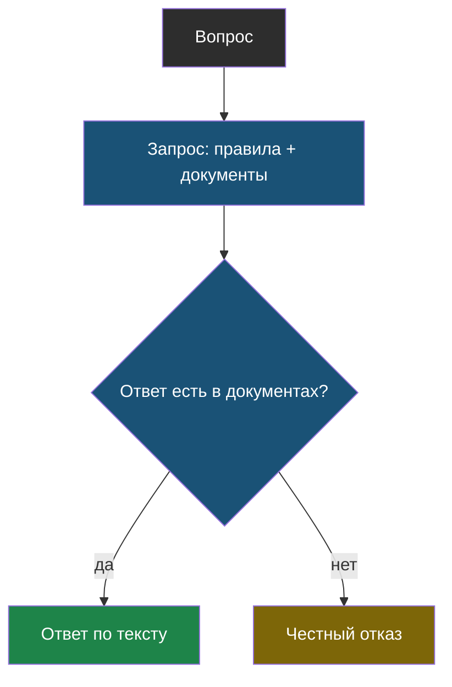
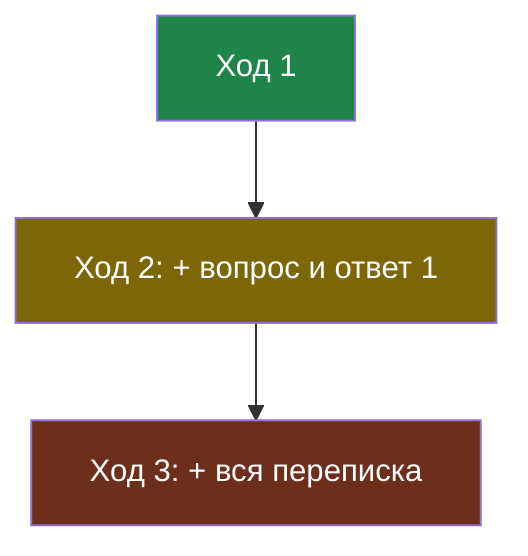
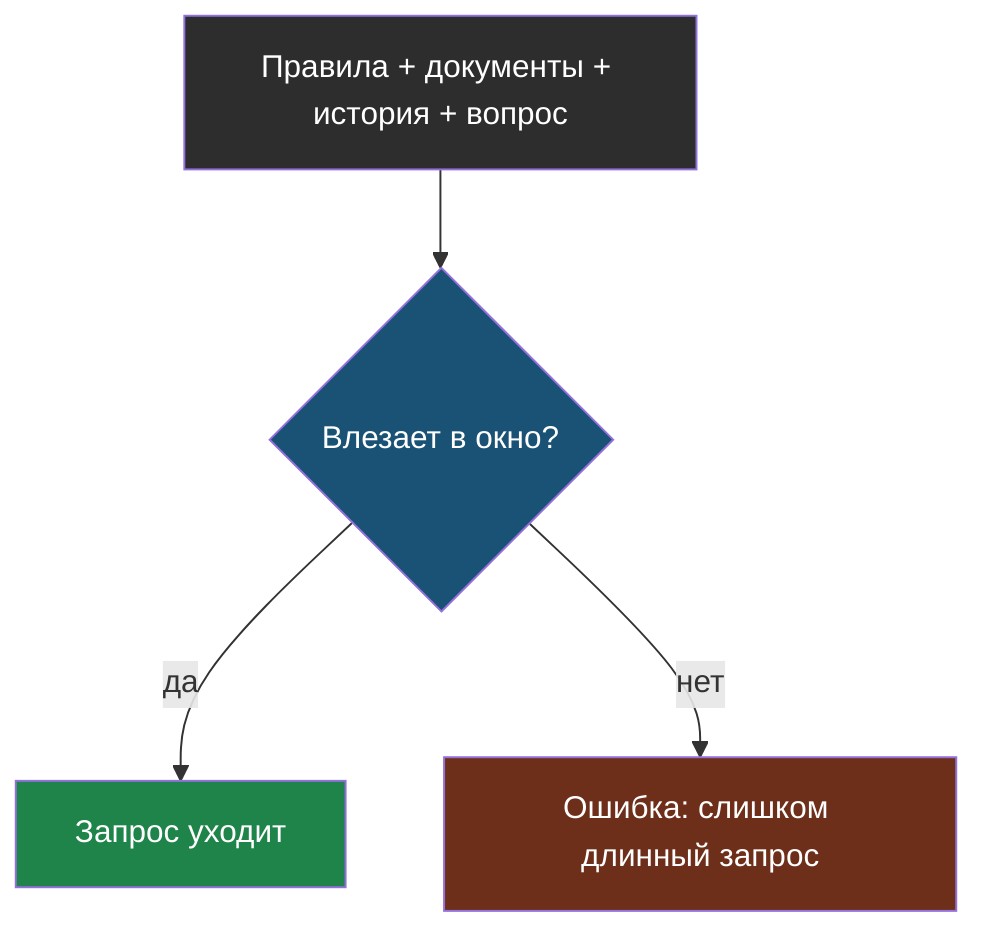
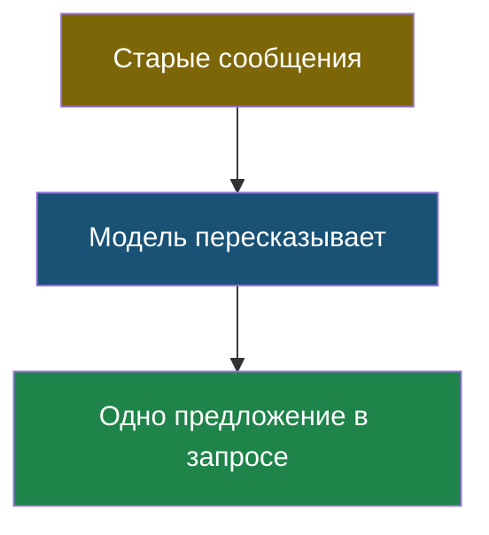
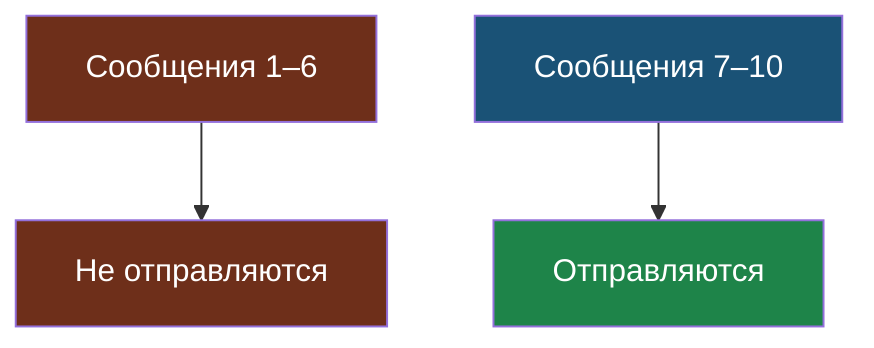

# Словарик модуля 3

Термины по алфавиту; названия латиницей — в конце.

## Грунтование (grounding)

> **Грунтование** — приём, при котором в запрос кладут нужные документы и требуют отвечать только по ним. Ответ «заземляется» на данные, которые вы дали сами.

Из [урока 1](chapter-01.md). Единственный честный способ получить верные факты.

## История диалога

> **История диалога** — все прошлые сообщения, которые отправляются модели вместе с новым вопросом, потому что сама модель между запросами ничего не помнит.

Из [урока 2](chapter-02.md). Каждый ход заново оплачивает предыдущие.

## Контекстное окно

> **Контекстное окно** — предел того, сколько токенов модель может принять за один запрос. Всё, что не влезло, отправить нельзя.

Из [урока 1](chapter-01.md). Цена обычно ограничивает раньше, чем окно.

## Пересказ истории

> **Пересказ истории** — приём, при котором старая часть диалога заменяется коротким изложением, которое пишет сама модель.

Из [урока 2](chapter-02.md). Помнит начало, но стоит отдельного запроса.

## Скользящее окно

> **Скользящее окно** — приём, при котором модели отправляют только несколько последних сообщений диалога, а более старые не отправляют вовсе.

Из [урока 2](chapter-02.md). Дёшево, но выпавшее забыто навсегда.

