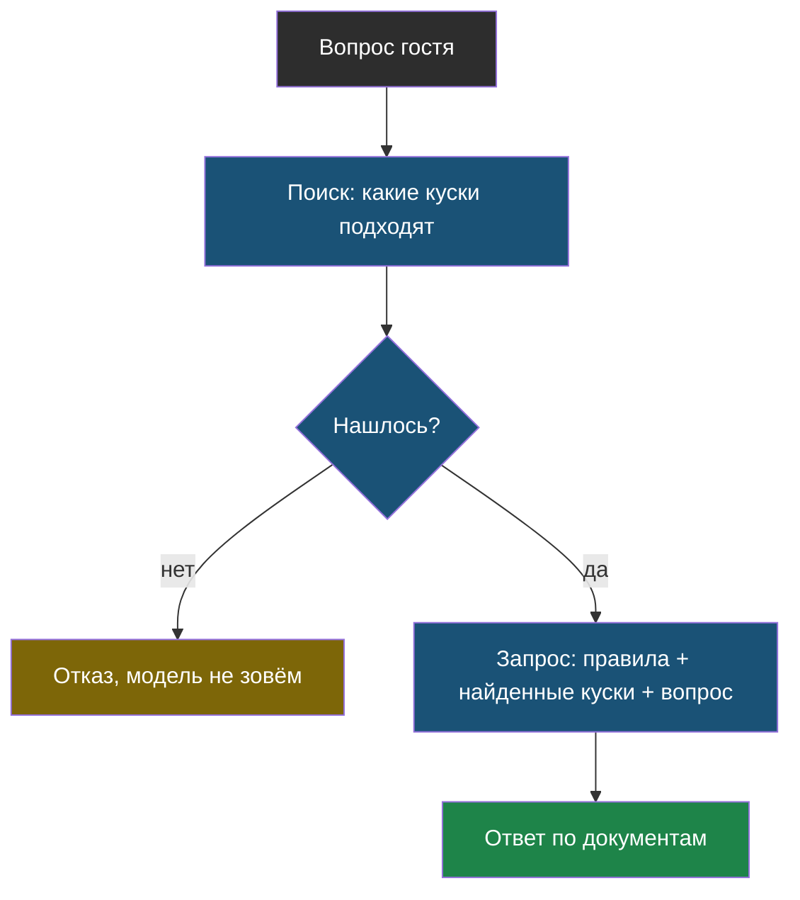

# Урок 1. Из сайта в куски

> **Лабораторной в этом уроке нет.** Практика модуля — в [уроке 2](chapter-02.md).

## Напомним, где мы остановились

v3 знает факты, потому что весь сайт едет в каждом запросе. Это работает и стоит денег: полезная часть запроса — шесть токенов из тысячи. Сейчас разберёмся, как отправлять только нужное.

## Что такое RAG

> **RAG** (от английского *retrieval-augmented generation*, «ответ с поиском») — схема, в которой программа сначала находит подходящие куски документов, а потом просит модель ответить только по ним.

Схема из трёх шагов, и все три — обычный код, кроме последнего:

Обратите внимание на левую ветку: если поиск ничего не нашёл, модель не вызывается вообще. Отказ выдаёт код — бесплатно, мгновенно и надёжнее любой просьбы.

И сразу важное следствие: у бота появилось **новое место поломки**. Раньше ошибиться могла только модель, теперь ещё и поиск. Зато и чинить стало понятнее: сначала смотрим, что нашлось.

## Шаг первый: HTML в текст

Страница сайта — это разметка: теги, меню, футер, скрипты. Модели всё это не нужно, а платим мы за каждый символ.

Простая очистка делает четыре вещи:

1. выкидывает `script` и `style` вместе с содержимым;
2. выкидывает `nav` и `footer` — меню повторяется на каждой странице и только мешает поиску;
3. снимает остальные теги, ставя переносы строк на месте абзацев и заголовков;
4. приводит пробелы и пустые строки в порядок.

В лабораторной страница услуг похудела с 1304 до 727 символов — почти вдвое. На настоящем сайте с версткой и аналитикой разница больше в разы.

Для продакшена берут готовые библиотеки (`beautifulsoup4`, `trafilatura`): они умнее, чем десять строк на регулярных выражениях. Но принцип тот же, и знать его нужно — иначе непонятно, почему из документа пропала таблица с ценами.

> **Правило очистки:** после неё текст нужно посмотреть глазами хотя бы на одной-двух страницах. Это то место, где легко потерять данные и не заметить.

## Шаг второй: нарезка

Даже чистая страница великовата: в вопросе про гарантию не нужен прайс на кофемашины.

> **Кусок** (по-английски *chunk*) — небольшой фрагмент документа, который ищут и отправляют модели целиком.

Каким его делать — вопрос с разменом:

| Размер куска | Плюс | Минус |
|---|---|---|
| Мелкий (абзац) | точное попадание, дешёвый запрос | смысл рвётся: условие и цена в разных кусках |
| Крупный (страница) | смысл целый | в запрос едет много лишнего |

И одна деталь, которую легко забыть: кусок должен быть **понятен сам по себе**. Фрагмент «от 4900 ₽, срок 1–2 дня» бесполезен: непонятно, о чём он. Поэтому к каждому куску добавляют заголовок страницы или раздела — это дёшево и сразу улучшает и поиск, и ответы.

В лабораторной пять страниц превратились в 11 кусков по 334 символа в среднем. Какая нарезка лучше, мы выясним в модуле 5 — по числам, а не на глаз.

## Что мы узнали

- **RAG** — найти нужные куски и ответить только по ним; поиск и отказ делает код, ответ — модель.
- Если поиск ничего не нашёл, честный отказ выдаётся **без запроса к модели**.
- У бота появилось новое место поломки: теперь ошибка может быть в поиске.
- HTML чистят от тегов, меню и футера; результат проверяют глазами.
- **Кусок** должен быть понятен сам по себе, поэтому к нему добавляют заголовок.

## Проверь себя

1. Почему при пустом результате поиска правильнее ответить отказом в коде, а не спросить модель?
2. Чем мелкая нарезка лучше крупной и чем хуже?
3. Зачем к каждому куску добавлять заголовок страницы?
