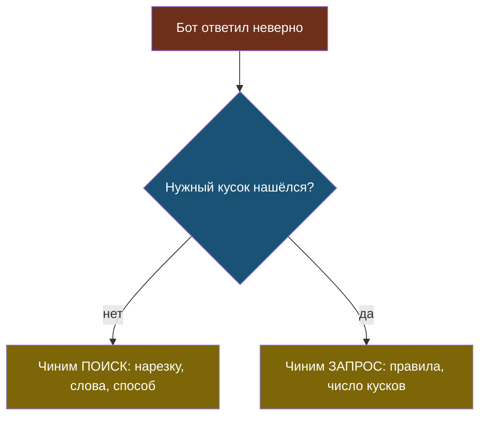

# Урок 2. Поиск и первый RAG

> **Лабораторная модуля:** сайт → текст → куски → поиск → ответ, и честное сравнение с v3.
> - [открыть в Google Colab](https://colab.research.google.com/github/iRoboTron/ai-docs-course/blob/main/docs/books/labs/modul4/01_prostoy_rag.ipynb) · [скачать .ipynb](labs/modul4/01_prostoy_rag.ipynb)
> - числа разобраны ниже, в разделе [«Что показала лабораторная»](#что-показала-лабораторная)

## Напомним, где мы остановились

Сайт превращён в текст и порезан на куски. Осталось главное: по вопросу гостя найти нужные куски.

## Поиск по словам

Самый простой поиск: посчитать, сколько слов вопроса встретилось в куске. Кусков больше совпадений — выше в списке.

```python
def v_slova(tekst):
    return {s[:6] for s in re.findall(r"[а-яёa-z0-9]+", tekst.lower()) if len(s) > 2}

def nayti(vopros, skolko=3):
    ocenki = [(len(v_slova(vopros) & v_slova(k["tekst"])), nomer)
              for nomer, k in enumerate(KUSKI)]
    ...
```

Здесь спрятана одна важная деталь: `s[:6]`.

> **Обрезка до основы** — грубый приём, при котором у слова берут только первые несколько букв, чтобы «подшипников» и «подшипники» стали одинаковыми.

Компьютер сравнивает строки, а не смыслы: «подшипников» и «подшипники» для него разные слова. Обрезка до шести букв — дешёвая замена настоящей морфологии. Она же и источник ошибок: «гарантия» и «гарантирует» станут одинаковыми, а «поменять» и «замена» — нет.

## Трасса поиска: главный инструмент отладки

Когда бот отвечает не то, вопрос всегда один: **виноват поиск или модель?** Ответить на него можно, только если видно, что нашлось и почему.

Поэтому поиск в лабораторной печатает не только найденные куски, но и **совпавшие слова**:

```
Вопрос: Почём поменять компрессор в холодильнике?
Слова вопроса: ['компре', 'поменя', 'почём', 'холоди']
   2 совпадений, кусок 3 (uslugi.html): ['компре', 'холоди']
```

Видно, что совпало два слова из четырёх — «поменять» с «заменой» не срослось, но «компрессор» и «холодильник» вытащили нужный кусок.



Один вопрос экономит часы: без него легко неделю править правила там, где виноват поиск.

## Что показала лабораторная

Прогон 16 сентября 2026 года на `qwen3.7-flash`. Сайт: 5 страниц → 11 кусков по 334 символа.

**Сравнение v3 и v4 на семи вопросах:**

| | v3: весь сайт | v4: три куска |
|---|---|---|
| Верных ответов | 7 из 7 | 6 из 7 |
| Входных токенов за прогон | 8297 | 2137 |
| Цена 100 000 вопросов | $3,82 | $1,17 |

Вот он, настоящий размен: **в 3,9 раза дешевле ценой одного проваленного вопроса**.

Никто не обещал, что новая версия будет лучше по всем колонкам сразу. Именно поэтому решения принимают по таблице, а не по ощущению «RAG же лучше».

**Что именно провалилось.** Вопрос «Какая у вас гарантия на ремонт?» — бот ответил про сроки выезда мастера. Поиск принёс кусок про порядок обращения по гарантии, а не про её срок: слово «гарантия» есть в обоих, и разошлись они лишь тем, какой стоял выше.

**Что сработало хорошо:**

- Вопрос про электросамокаты: поиск не нашёл ничего, бот ответил отказом **без запроса к модели** — вход 0 токенов, цена 0.
- Вопрос «почём поменять компрессор», заданный не теми словами, что на сайте, всё же нашёлся: хватило двух совпавших слов.

## Найди ошибку

Разработчик увидел провал с гарантией и решил его так:

```python
def bot_v4(vopros):
    naydeno = nayti(vopros, skolko=10)     # было 3, стало 10
    ...
```

Провал исчез, все семь вопросов верные. Что не так с таким исправлением?

<details>
<summary>Ответ</summary>

Формально всё честно: больше кусков — выше шанс, что нужный попадёт. Но:

1. **Цена вернулась.** Наших кусков всего 11, значит, в запрос поехало почти всё — то есть мы вернулись к v3, только длинной дорогой.
2. **Проблема поиска не решена.** Он по-прежнему ставит не тот кусок первым; мы просто прикрыли это количеством. На сайте из тысячи кусков десять первых уже не спасут.
3. **Больше мусора в запросе** — модель чаще берёт факт не из того куска. Это видно не сразу, а на редких вопросах.

Правильный порядок: сначала понять, **почему** нужный кусок оказался ниже, и чинить поиск или нарезку. Число кусков — тоже параметр, но выбирают его осознанно и по замеру, а не как затычку. Этим и займёмся в модуле 5.
</details>

## Что мы узнали

- Поиск по словам сравнивает строки, а не смыслы; **обрезка до основы** частично лечит формы слов.
- **Трасса поиска** показывает, какие слова совпали, и отвечает на вопрос «поиск или модель».
- RAG дал выигрыш в цене в 3,9 раза и стоил одного проваленного вопроса.
- Пустой результат поиска — повод ответить отказом бесплатно, без запроса к модели.
- Увеличивать число кусков, чтобы закрыть провал, — маскировка, а не исправление.

## Проверь себя

1. Почему «подшипников» и «подшипники» — разные слова для поиска и что с этим делают?
2. Бот ответил неверно. Какой первый вопрос вы зададите и как на него ответите?
3. v4 дешевле в 4 раза и хуже на один вопрос. Какие есть варианты действий и от чего зависит выбор?

## Что добавилось в сервис

- **v4** — очистка HTML, нарезка на куски, поиск по словам, ответ только по найденному.
- **Трасса поиска** — видно, что нашлось и по каким словам.
- **Разметка эталона** — для каждого вопроса известно, какой кусок правильный. Она понадобится в модуле 5.
- **`decisions.md`** — запись: v4 принята, размен «в 4 раза дешевле ценой одного вопроса».

## Итог модуля 4

У нас работающий RAG и понятное место, где он проигрывает. В модуле 5 мы перестанем гадать: сравним варианты нарезки и поиска на одних данных, посчитаем Hit@k и MRR и выберем связку по числам.
