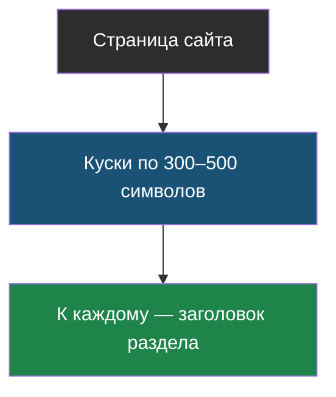
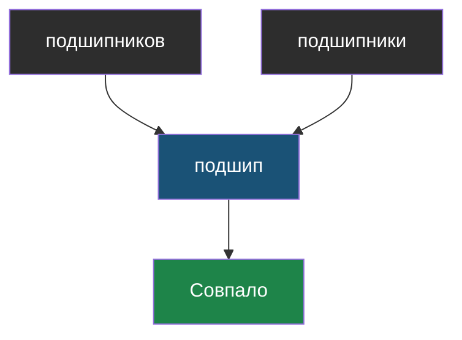
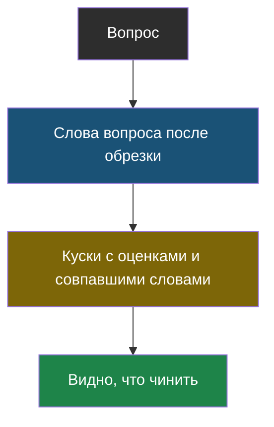
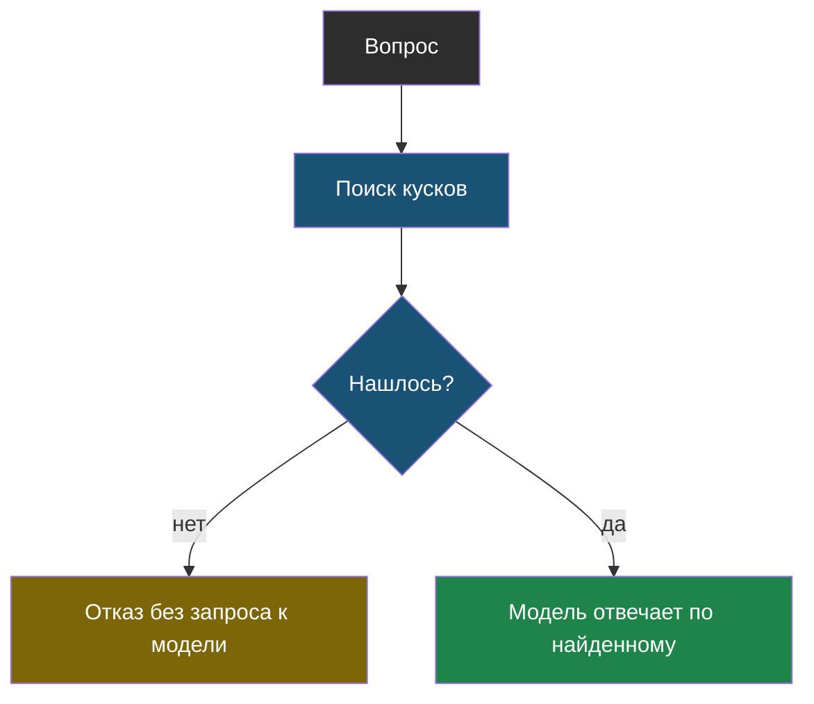

# Словарик модуля 4

Термины по алфавиту; названия латиницей — в конце.

## Кусок (chunk)

> **Кусок** — небольшой фрагмент документа, который ищут и отправляют модели целиком.

Из [урока 1](chapter-01.md). Должен быть понятен сам по себе, поэтому к нему добавляют заголовок.

## Обрезка до основы

> **Обрезка до основы** — грубый приём, при котором у слова берут только первые несколько букв, чтобы «подшипников» и «подшипники» стали одинаковыми.

Из [урока 2](chapter-02.md). Дешёвая замена морфологии и источник своих ошибок.

## Трасса поиска

> **Трасса поиска** — вывод, показывающий, какие куски нашлись, с какой оценкой и по каким совпавшим словам.

Из [урока 2](chapter-02.md). Отвечает на вопрос «виноват поиск или модель».

## RAG (ответ с поиском)

> **RAG** — схема, в которой программа сначала находит подходящие куски документов, а потом просит модель ответить только по ним.

Из [урока 1](chapter-01.md). Поиск и отказ делает код, ответ — модель.

