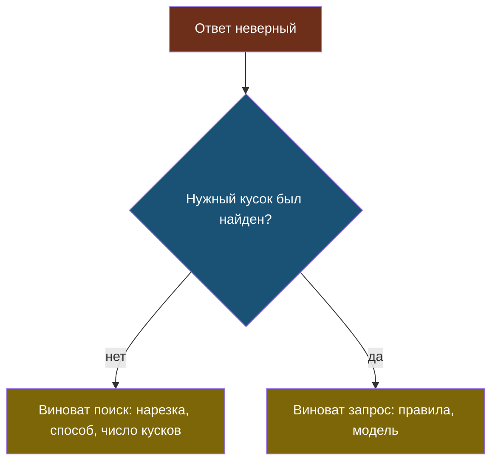

# Урок 1. Чем мерить поиск

> **Лабораторной в этом уроке нет.** Практика модуля — в [уроке 2](chapter-02.md).

## Напомним, где мы остановились

v4 дешевле v3 в четыре раза и на один вопрос хуже: поиск не принёс кусок про срок гарантии. Чинить наугад мы не будем — сначала научимся мерить сам поиск, отдельно от ответов.

## Зачем мерить поиск отдельно

Ответ бота зависит от двух вещей: что нашёл поиск и что модель из этого сделала. Если мерить только конечный ответ, причина провала остаётся неизвестной.

Плюс замер поиска **бесплатный**: он не вызывает модель, значит, его можно гонять после каждой правки хоть сто раз.

## На одном вопросе

Представь, что ищешь нужную картинку в галерее, а поиск выдаёт список результатов по порядку — угадал он или нет, видно сразу по тому, где в списке оказалось нужное. С кусками документов то же самое: для вопроса поиск возвращает список кандидатов, и у нас есть эталон — какой из них на самом деле правильный (модуль 4).

Пусть на вопрос «Какая гарантия на ремонт?» поиск вернул три кандидата:

1. мусор
2. **нужное**
3. мусор

> **Hit@k** — «попал ли нужный результат в первые k?» k — это сколько верхних результатов мы разрешаем себе посмотреть. Ответ — да (1) или нет (0), про место внутри этих k ничего не говорит.

- **Hit@1** — среди первого одного результата нужного нет (там мусор) → **0**.
- **Hit@3** — среди первых трёх нужное есть (на 2-м месте) → **1**.

> **MRR** (обратный ранг для одного вопроса) — единица, делённая на позицию, где нашёлся нужный результат: 1-е место даёт 1, 2-е — 0,5, 3-е — 0,33, 10-е — 0,1, «не нашёлся» — 0.

Для нашего примера нужное на 2-м месте: **MRR = 1/2 = 0,5**.

Разница между метриками видна на паре примеров с одним и тем же Hit@3:

| Где нашлось нужное | Hit@3 | MRR |
|---|---|---|
| на 1-м месте | 1 | 1/1 = **1,0** |
| на 3-м месте | 1 | 1/3 = **0,33** |

Hit@3 в обоих случаях говорит одно и то же: «нашли». А MRR показывает, что в первом случае нашли **сразу**, а во втором — еле-еле уместились в лимит. Для модели это разница ощутимая: она обычно смотрит в первую очередь на верхние результаты, и если нужный кусок 9-й, а не 1-й, модель до него может просто не дойти.

## Теперь на многих вопросах: усредняем

По одному вопросу метрику никто не считает — их усредняют по целому набору. Взяли 5 знакомых вопросов из журнала случаев и прогнали поиск с `k=5` (пять кандидатов на вопрос):

| Вопрос | На каком месте нашёлся нужный кусок |
|---|---|
| Во сколько вы закрываетесь в субботу? | 1-е |
| Какая гарантия на ремонт? | 2-е |
| Сколько стоят подшипники? | 3-е |
| Сколько стоит курьер? | не нашёлся вообще |
| Сколько стоит хранение техники? | не нашёлся вообще |

**Hit@3** — доля вопросов, у которых место 1, 2 или 3:

- «Суббота» — место 1 → попал.
- «Гарантия» — место 2 → попал.
- «Подшипники» — место 3 → попал.
- «Курьер» — не нашёлся → не попал.
- «Хранение» — не нашёлся → не попал.

Попало 3 вопроса из 5: **Hit@3 = 3/5 = 60%**.

**MRR** — то же самое «1 / место», что считали на одном вопросе, только теперь для каждого вопроса своё и в конце — среднее:

| Вопрос | Место | 1 / место |
|---|---|---|
| Суббота | 1 | 1 / 1 = 1,00 |
| Гарантия | 2 | 1 / 2 = 0,50 |
| Подшипники | 3 | 1 / 3 = 0,33 |
| Курьер | — | 0 |
| Хранение | — | 0 |

Складываем и делим на число вопросов: (1,00 + 0,50 + 0,33 + 0 + 0) / 5 = 1,83 / 5 = **0,37**.

«Средний обратный ранг» в расшифровке MRR — буквально это: обратный ранг (1/место) для каждого вопроса, усреднённый по всем вопросам. Ничего сверх того, что уже посчитали на одном вопросе выше.

## Зачем нужны обе: пример, где Hit@3 не помогает выбрать

Представим, что ту же пятёрку вопросов прогнали через **другую** нарезку документов — и получили другую таблицу:

| Вопрос | Вариант А: место | Вариант Б: место |
|---|---|---|
| Суббота | 1 | 1 |
| Гарантия | 2 | 1 |
| Подшипники | 3 | 2 |
| Курьер | не нашёлся | не нашёлся |
| Хранение | не нашёлся | не нашёлся |

Hit@3 у обоих вариантов одинаковый — по 3 попадания из 5, **60% против 60%**. По этому числу выбрать нарезку нельзя: результат неотличим.

Теперь MRR. Вариант А мы уже посчитали — 0,37. Вариант Б:

(1/1 + 1/1 + 1/2 + 0 + 0) / 5 = (1,00 + 1,00 + 0,50) / 5 = 2,50 / 5 = **0,50**.

Вот и разница: 0,37 против 0,50. Хотя оба варианта находят нужный кусок с одинаковой частотой, в варианте Б он в среднем стоит **выше** в списке. На практике это значит: варианту Б можно отправлять модели меньше кандидатов (скажем, топ-2 вместо топ-3) и платить за это меньше — а варианту А для той же надёжности нужно везти больше кусков.

Ровно это и произошло в настоящей лабораторной этого модуля: у двух вариантов нарезки Hit@3 совпал — 70% на 70%, а MRR разошёлся — 0,58 против 0,65. Число вопросов и сами позиции там другие, но механизм ровно тот же, что и в игрушечном примере выше.

| | Что показывает | Когда важнее |
|---|---|---|
| Hit@k | найден ли нужный кусок вообще | когда кусков в запрос отправляем много |
| MRR | насколько высоко он в списке | когда хотим сократить число кусков |

## Откуда берётся эталон

Чтобы посчитать эти метрики, нужно знать, **какой кусок правильный** для каждого вопроса. Этот список и есть эталон.

> **Эталон поиска** — размеченный набор: для каждого вопроса известно, какие куски содержат ответ.

Размечают его полуавтоматически: код предлагает кандидатов (например, ищет ожидаемую строку ответа), человек смотрит и подтверждает. Мы сделали это ещё в модуле 4.

Две ловушки разметки — обе на реальных данных «Полярис» из модуля 6:

1. **Слишком общая ожидаемая строка.** В документах есть и «Диагностика стоит 1200 ₽», и «Курьер туда и обратно — 1200 рублей». Если разметить вопрос про курьера ожидаемой строкой `"1200"`, код-разметчик подтвердит **сразу оба** куска — про курьера и про диагностику — как «правильные». Вопрос перестаёт что-либо проверять: любой из двух кусков засчитается как верный, даже если поиск перепутал курьера с диагностикой.
2. **Вопросы без ответа.** Они обязаны быть в наборе: правильное поведение — **не найти ничего**. Без них легко получить поиск, который всегда что-то приносит, даже когда честный ответ — «в документах этого нет».

## Правило одного фактора

У RAG три очевидных ручки: как резать, чем искать, сколько кусков отправлять. Соблазн — покрутить все сразу и посмотреть, что вышло.

Почему это ловушка — на примере. Допустим, заодно поменяли и нарезку, и способ поиска, и Hit@3 вырос с 60% до 80%. Хорошая новость, но бесполезная: неизвестно, чья заслуга — новой нарезки, нового поиска или их совпадения. В следующий раз, когда одна из этих ручек понадобится подкрутить отдельно (например, добавили новый тип документа и нарезку нужно переделать), непонятно, что можно менять без риска потерять прирост, а что — нельзя.

Меняем **по одной**:

1. фиксируем поиск и число кусков → выбираем нарезку;
2. фиксируем выбранную нарезку → выбираем поиск;
3. фиксируем и то и другое → выбираем число кусков.

Это не медленнее, чем перебирать всё: три замера вместо десятков комбинаций. И у каждого шага появляется своя запись в журнале решений — известно, что именно и почему подняло число.

## Что мы узнали

- Поиск меряют **отдельно** от ответов: замер бесплатный и сразу показывает виновника.
- **Hit@k** говорит «нашли ли», **MRR** — «насколько высоко»; на примере из 5 вопросов Hit@3 = 60%, MRR = 0,37 — два разных числа про одну и ту же таблицу.
- При равном Hit@k выбор делает MRR: в примере с двумя нарезками оба варианта нашли 3 из 5 вопросов, но у варианта Б нужный кусок в среднем выше — 0,50 против 0,37.
- **Эталон поиска** размечают полуавтоматически; в нём обязательно есть вопросы без ответа, а ожидаемая строка не должна совпадать сразу с несколькими фактами (как «1200» у курьера и диагностики).
- Факторы меняют по одному, иначе непонятно, чья заслуга в приросте числа.

## Проверь себя

1. По таблице «живого примера» посчитай Hit@1 (место ровно 1) для тех же 5 вопросов. Получится больше или меньше, чем Hit@3?
2. Зачем в эталоне нужны вопросы, ответа на которые в документах нет?
3. Почему нельзя сравнить сразу все комбинации нарезок и поисков и взять лучшую?
