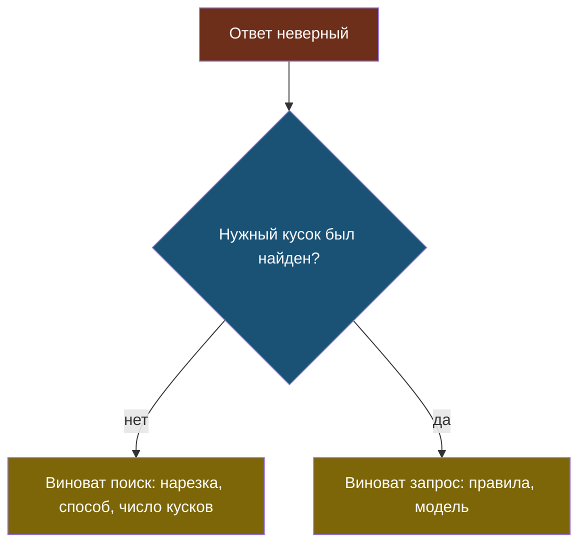

# Урок 1. Чем мерить поиск

> **Лабораторной в этом уроке нет.** Практика модуля — в [уроке 2](chapter-02.md).

## Напомним, где мы остановились

v4 дешевле v3 в четыре раза и на один вопрос хуже: поиск не принёс кусок про срок гарантии. Чинить наугад мы не будем — сначала научимся мерить сам поиск, отдельно от ответов.

## Зачем мерить поиск отдельно

Ответ бота зависит от двух вещей: что нашёл поиск и что модель из этого сделала. Если мерить только конечный ответ, причина провала остаётся неизвестной.

Плюс замер поиска **бесплатный**: он не вызывает модель, значит, его можно гонять после каждой правки хоть сто раз.

## Две метрики

> **Hit@k** — доля вопросов, для которых нужный кусок попал в первые k найденных. Отвечает на вопрос «нашли ли вообще».

> **MRR** (средний обратный ранг) — среднее от единицы, делённой на позицию первого нужного куска: первое место даёт 1, второе 0,5, третье 0,33. Отвечает на вопрос «насколько высоко нашли».

Почему нужны обе, видно на живом примере из лабораторной: у двух вариантов нарезки Hit@3 оказался **одинаковым — 70%**, и по нему выбрать было нельзя. Разошлись они по MRR: 0,58 против 0,65. У второго варианта нужный кусок стоял выше в списке — значит, можно отправлять модели меньше кусков и платить меньше.

| | Что показывает | Когда важнее |
|---|---|---|
| Hit@k | найден ли нужный кусок вообще | когда кусков в запрос отправляем много |
| MRR | насколько высоко он в списке | когда хотим сократить число кусков |

## Откуда берётся эталон

Чтобы посчитать эти метрики, нужно знать, **какой кусок правильный** для каждого вопроса. Этот список и есть эталон.

> **Эталон поиска** — размеченный набор: для каждого вопроса известно, какие куски содержат ответ.

Размечают его полуавтоматически: код предлагает кандидатов (например, ищет ожидаемую строку ответа), человек смотрит и подтверждает. Мы сделали это ещё в модуле 4.

Две ловушки разметки:

1. **Слишком общая ожидаемая строка.** «1200» встречается и в цене диагностики, и в цене курьера — такой вопрос размечается сразу тремя кусками и перестаёт что-либо проверять.
2. **Вопросы без ответа.** Они обязаны быть в наборе: правильное поведение — **не найти ничего**. Без них легко получить поиск, который всегда что-то приносит.

## Правило одного фактора

У RAG три очевидных ручки: как резать, чем искать, сколько кусков отправлять. Соблазн — покрутить все сразу и посмотреть, что вышло.

Так делать нельзя: если качество выросло, непонятно, какая ручка помогла, а какая испортила. Меняем **по одной**:

1. фиксируем поиск и число кусков → выбираем нарезку;
2. фиксируем выбранную нарезку → выбираем поиск;
3. фиксируем и то и другое → выбираем число кусков.

Это не медленнее, чем перебирать всё: три замера вместо десятков комбинаций. И у каждого шага появляется своя запись в журнале решений.

## Что мы узнали

- Поиск меряют **отдельно** от ответов: замер бесплатный и сразу показывает виновника.
- **Hit@k** говорит «нашли ли», **MRR** — «насколько высоко»; при равном Hit@k выбор делает MRR.
- **Эталон поиска** размечают полуавтоматически; в нём обязательно есть вопросы без ответа.
- Слишком общая ожидаемая строка делает случай бесполезным.
- Факторы меняют по одному, иначе результат невозможно объяснить.

## Проверь себя

1. У двух вариантов Hit@3 одинаковый, MRR разный. Какой брать и почему?
2. Зачем в эталоне нужны вопросы, ответа на которые в документах нет?
3. Почему нельзя сравнить сразу все комбинации нарезок и поисков и взять лучшую?
