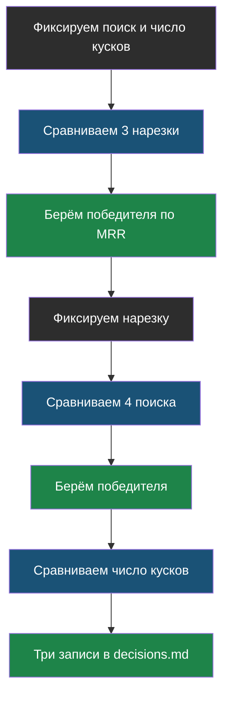

# Урок 2. Три фактора и выбор

> **Лабораторная модуля:** сравнение нарезок, поисков и числа кусков на одних данных.
> - [открыть в Google Colab](https://colab.research.google.com/github/iRoboTron/ai-docs-course/blob/main/docs/books/labs/modul5/01_kakoy_rag.ipynb) · [скачать .ipynb](labs/modul5/01_kakoy_rag.ipynb)
> - числа разобраны ниже, в разделе [«Что показала лабораторная»](#что-показала-лабораторная)

## Напомним, где мы остановились

Мы умеем мерить поиск отдельно: Hit@k и MRR по размеченному эталону. Теперь покрутим три ручки — по одной.

## Фактор 1: как резать

Три способа порезать один и тот же текст:

| Способ | Как | Чего ждём |
|---|---|---|
| **По размеру** | набираем абзацы, пока не наберётся 400 символов | просто, но режет посреди мысли |
| **По абзацам** | каждый абзац — кусок | точное попадание, но смысл рвётся |
| **По заголовкам** | кусок = раздел страницы | смысл целый, кусок крупнее |

Резать по заголовкам логичнее всего: на сайте раздел «Гарантия» — это и есть смысловая единица. Но логика — не аргумент, аргумент — числа.

## Фактор 2: чем искать

> **Поиск по смыслу** — способ, при котором текст превращается в набор чисел (вектор), а близость вопроса и куска считается как близость этих чисел. Совпадение слов при этом не требуется.

Сравниваем четыре варианта:

- **по словам** — счёт совпавших слов, как в модуле 4;
- **BM25** — тот же счёт, но редкое слово весит больше частого;
- **по смыслу** — эмбеддинги;
- **гибрид** — объединение двух списков по формуле обратных рангов.

> **Гибрид (RRF)** — объединение результатов двух поисков по позициям: каждый кусок получает сумму «единица делить на его место в списке». Сырые оценки разных систем несравнимы, а места — сравнимы.

У поиска по смыслу есть особенность, о которой легко забыть: он **всегда** возвращает ближайшие куски, даже когда ответа нет вовсе. Поэтому ему нужен **порог близости**: ниже порога — считаем, что не нашли.

## Фактор 3: сколько кусков отправлять

Чем больше кусков, тем выше шанс, что ответ там есть, и тем дороже запрос. Ищем перегиб: место, где качество перестало расти, а цена растёт дальше.

## Порядок сравнения

Три замера вместо двенадцати комбинаций — и на каждом шаге понятно, что именно дало результат.

## Что показала лабораторная

Прогон 16 сентября 2026 года. Сайт «Поляриса», эталон из 10 вопросов, один из которых без ответа на сайте.

**Фактор 1 — нарезка** (поиск фиксирован — по словам, кусков 3):

| Нарезка | Кусков | Средняя длина | Hit@3 | MRR |
|---|---|---|---|---|
| по размеру 400 | 11 | 334 | 70% | 0,58 |
| по абзацам | 27 | 129 | 60% | 0,50 |
| **по заголовкам** | 18 | 208 | **70%** | **0,65** |

Вот зачем нужны две метрики: по Hit@3 первый и третий варианты неразличимы, выбор делает MRR. А мелкая нарезка по абзацам проиграла обоим — куски по 129 символов рвут смысл: цена оказывается в одном куске, условие в другом.

**Фактор 2 — поиск** (нарезка по заголовкам):

| Поиск | Hit@3 | MRR | Провалы |
|---|---|---|---|
| по словам | 70% | 0,65 | garantiya, srochno, plata |
| BM25 | 70% | 0,60 | garantiya, srochno, plata |
| **по смыслу** | **80%** | **0,73** | srochno, plata |
| гибрид RRF | 80% | 0,68 | srochno, plata |

Три вывода, и два из них против «общеизвестного»:

1. **Поиск по смыслу починил вопрос про гарантию** — тот самый, что провалился в модуле 4. Слова не совпадали, смысл совпал.
2. **BM25 не выиграл у простого счёта слов.** На корпусе из 18 кусков весам редких слов негде разыграться: BM25 раскрывается на тысячах документов.
3. **Гибрид не выиграл у чистого смысла.** Hit@3 тот же, MRR ниже: он подмешал наверх куски словесного поиска. Хорошее напоминание, что «сложнее» не значит «лучше» — это проверяют, а не предполагают.

**Фактор 3 — число кусков** (нарезка по заголовкам, поиск по смыслу):

| Кусков | Hit@k | MRR | Символов в запросе |
|---|---|---|---|
| 1 | 70% | 0,70 | 208 |
| 2 | 70% | 0,70 | 377 |
| **3** | **80%** | **0,73** | 478 |
| 5 | 80% | 0,73 | 735 |
| 8 | 90% | 0,75 | 1038 |

Переход с 3 на 5 не дал ничего и подорожал в полтора раза. Переход на 8 добавил 10 процентных пунктов ценой удвоения запроса — это уже осознанный выбор, а не «пусть будет побольше». Мы берём 3.

**Проверка ответами:** 8 из 10 верных, средний вход 244 токена, цена вопроса $0,00001.

## Провал, который оказался ошибкой проверки

Один из двух «неверных» ответов таким не был.

Вопрос: «Сколько стоит курьер туда и обратно?» Ответ бота: «Курьерская доставка туда и обратно стоит 1200 ₽». Верно по сути и по числу. Но проверка искала подстроку «1200 ₽ туда и обратно», а в ответе слова стоят в другом порядке — и поставила ❌.

> **Метрика, которая называет верный ответ неверным, вреднее отсутствия метрики.** По ней принимают решения: можно «починить» то, что работало, и сломать то, что было в порядке.

Проверка по вхождению строки не понимает языка. В модуле 6 мы займёмся проверками всерьёз: сравнением по фактам, по числам и ИИ-судьёй.

## Найди ошибку

Разработчик прочитал статью «гибридный поиск с реранкером — стандарт индустрии» и сразу поставил его в бот, пропустив сравнение. Качество не изменилось, а ответы стали идти в полтора раза дольше. Что он сделал не так?

Ответ

Он принял чужое решение вместо своего. «Стандарт индустрии» — это про другие корпуса: миллионы документов, разнородные запросы, борьба за доли процента. На сайте из 18 кусков гибрид в нашей лабораторной **не выиграл ничего**, а стоит он двух поисков плюс модель эмбеддингов в памяти.

Правильный порядок: замерить простое, замерить сложное, сравнить на своих данных и записать решение. Тогда через полгода, когда сайт вырастет в сто раз, будет понятно, что именно пора пересматривать — и почему.

И обратная ошибка тоже бывает: отказаться от гибрида навсегда. Решение принято **на этом корпусе** и живёт до тех пор, пока корпус такой.

## Что мы узнали

- Факторы сравнивают по одному: нарезка → поиск → число кусков.
- При равном Hit@k выбор делает **MRR**: чем выше нужный кусок, тем меньше кусков можно слать.
- **Поиск по смыслу** находит ответ там, где слова не совпадают, но требует порога близости.
- Ни **BM25**, ни **гибрид** не выиграли на нашем корпусе: сложное решение проверяют, а не предполагают.
- Число кусков выбирают там, где качество перестаёт расти, а цена растёт дальше.
- Проверка по вхождению строки объявила верный ответ неверным — метрику тоже нужно проверять.

## Проверь себя

1. Почему нарезка по абзацам проиграла, хотя куски точнее попадают в вопрос?
2. Гибрид сложнее и дороже, а качество то же. Что записать в журнал решений?
3. Бот ответил «доставка туда и обратно стоит 1200 ₽», а проверка поставила ❌. Что чинить?

## Что добавилось в сервис

- **v5** — выбранная связка: нарезка по заголовкам, поиск по смыслу, три куска.
- **Замер поиска** — бесплатный прогон Hit@k и MRR после любой правки.
- **`decisions.md`** — три записи, по одной на фактор, каждая с таблицей.
- **`antipatterns.md`** — «взять гибрид, потому что так пишут в статьях» и «поиск по смыслу без порога близости».

## Итог модуля 5

Связка выбрана по числам, и мы знаем, при каких условиях её придётся пересмотреть. Осталась последняя дыра: бот отвечает, но **проверить его ответ нечем** — сегодняшняя проверка уже один раз соврала. В модуле 6 мы добавим цитаты, проверку ссылок кодом и ИИ-судью.
