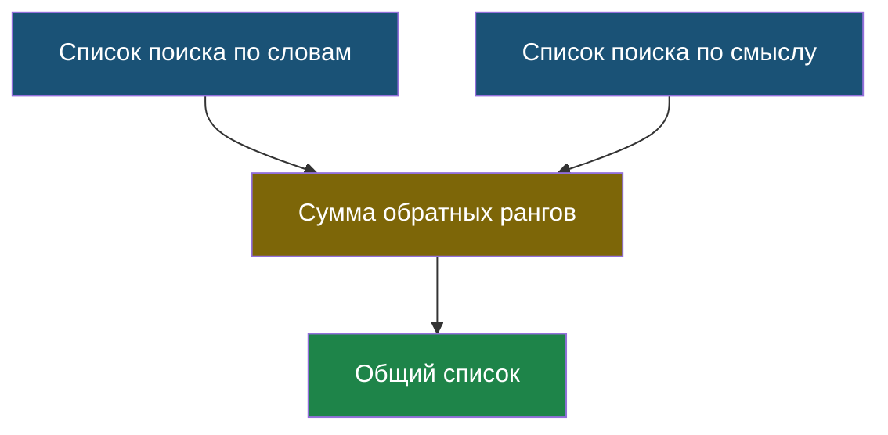
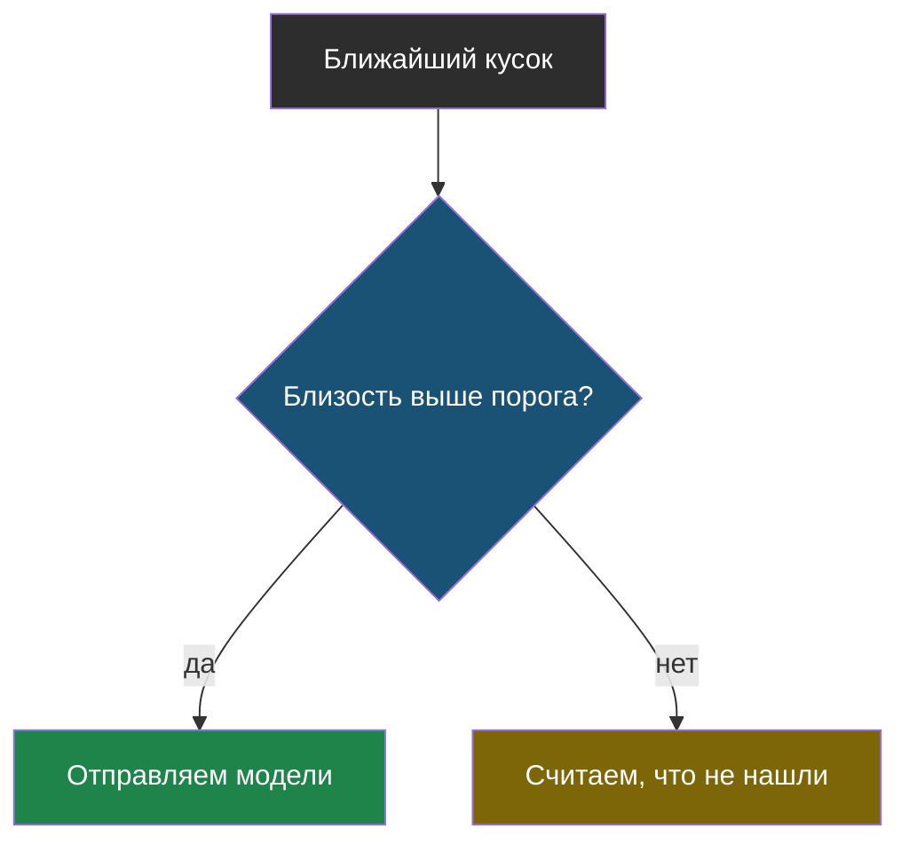
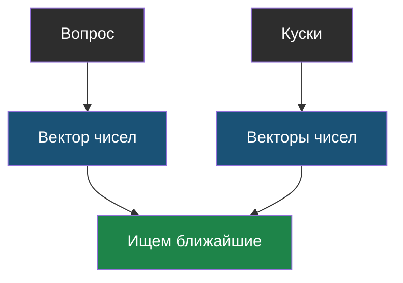
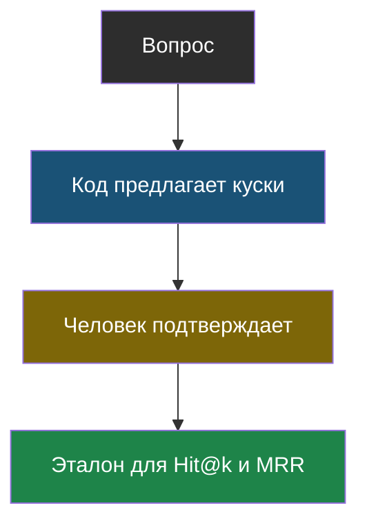
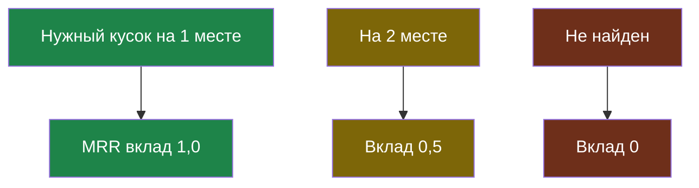

# Словарик модуля 5

Термины по алфавиту; названия латиницей — в конце.

## Гибрид (RRF)

> **Гибрид (RRF)** — объединение результатов двух поисков по позициям: каждый кусок получает сумму «единица делить на его место в списке». Сырые оценки разных систем несравнимы, а места — сравнимы.

Из [урока 2](chapter-02.md). На маленьком корпусе может не выиграть ничего.

## Порог близости

> **Порог близости** — минимальная близость вопроса и куска, ниже которой считается, что ничего не нашлось.

Из [урока 2](chapter-02.md). Без него поиск по смыслу всегда что-то возвращает и бот перестаёт честно отказываться.

## Поиск по смыслу

> **Поиск по смыслу** — способ, при котором текст превращается в набор чисел (вектор), а близость вопроса и куска считается как близость этих чисел. Совпадение слов не требуется.

Из [урока 2](chapter-02.md). Находит ответ, когда вопрос задан другими словами.

## Эталон поиска

> **Эталон поиска** — размеченный набор: для каждого вопроса известно, какие куски содержат ответ.

Из [урока 1](chapter-01.md). Обязательно содержит вопросы, ответа на которые нет.

## Hit@k и MRR

> **Hit@k** — доля вопросов, для которых нужный кусок попал в первые k найденных. **MRR** — среднее от единицы, делённой на позицию первого нужного куска.

Из [урока 1](chapter-01.md). При равном Hit@k выбор делает MRR.

