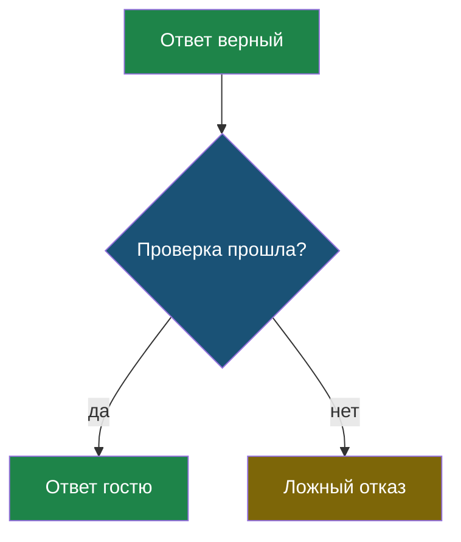
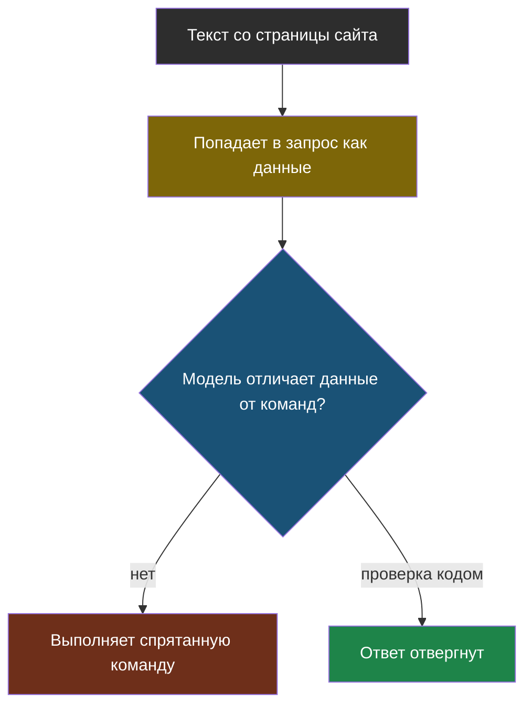
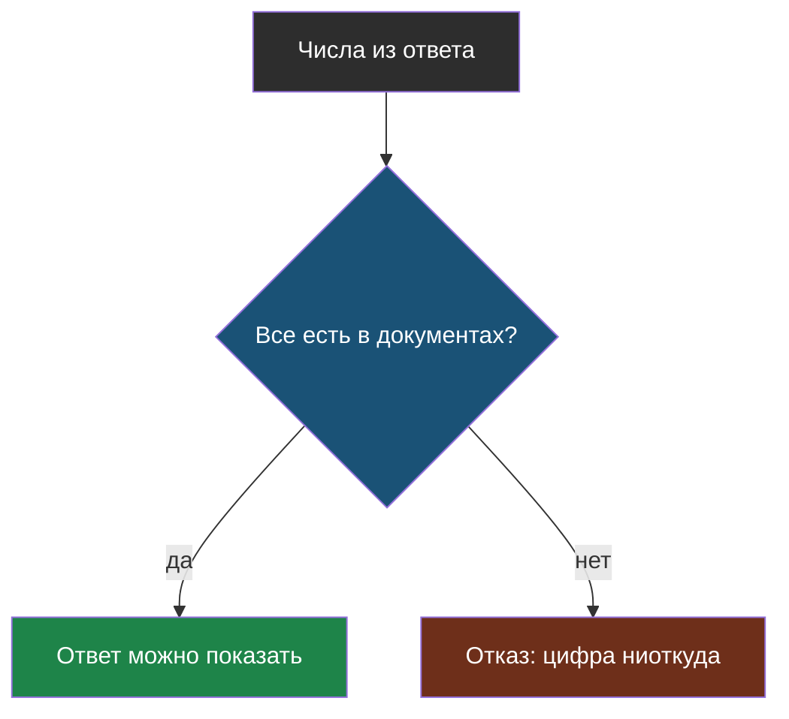
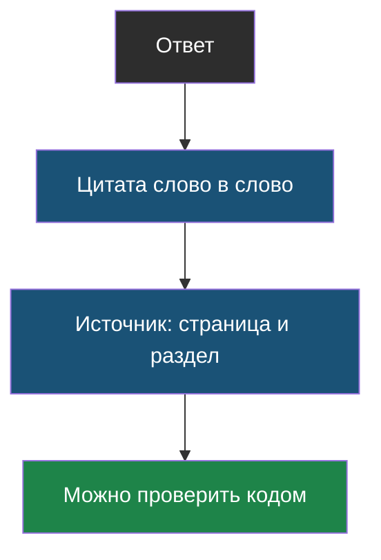
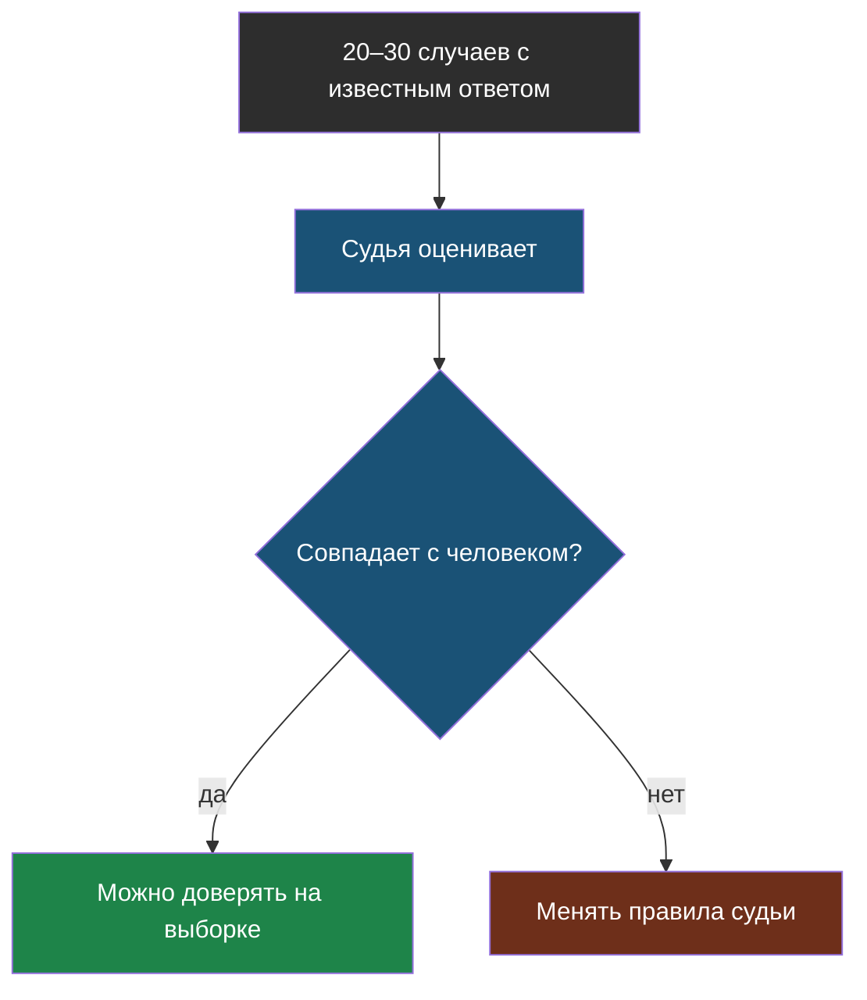
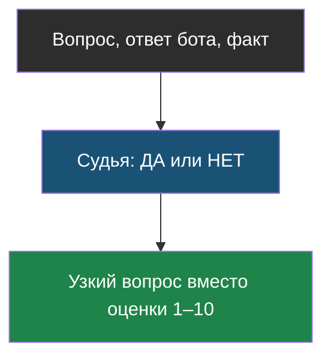

# Словарик модуля 6

Термины по алфавиту; названия латиницей — в конце.

## Ложный отказ

> **Ложный отказ** — случай, когда система отказывается отвечать, хотя ответ был верным.

Из [урока 1](chapter-01.md). Плата за строгие проверки; долю таких отказов нужно мерить.

## Подмена инструкций (prompt injection)

> **Подмена инструкций** — вредная команда, спрятанная в данных; модель выполняет её как указание разработчика.

Из [урока 1](chapter-01.md). Защищает не правило в запросе, а проверка ответа кодом.

## Проверка чисел

> **Проверка чисел** — правило, по которому все числа из ответа обязаны встречаться в найденных кусках.

Из [урока 1](chapter-01.md). Ловит выдуманные цены и сроки.

## Прослеживаемость

> **Прослеживаемость** — свойство ответа, при котором видно, на каком месте в документах он основан.

Из [урока 1](chapter-01.md). Даёт и доверие гостя, и возможность проверки кодом.

## Сверка судьи

> **Сверка судьи** — проверка самого судьи на случаях с известным ответом, до того как ему поручат оценивать всё остальное.

Из [урока 2](chapter-02.md).

## ИИ-судья

> **ИИ-судья** — модель, которой поручили оценить ответ другой модели по чётким правилам.

Из [урока 2](chapter-02.md). Нужен там, где код бессилен: «до пяти вечера» = 17:00.

