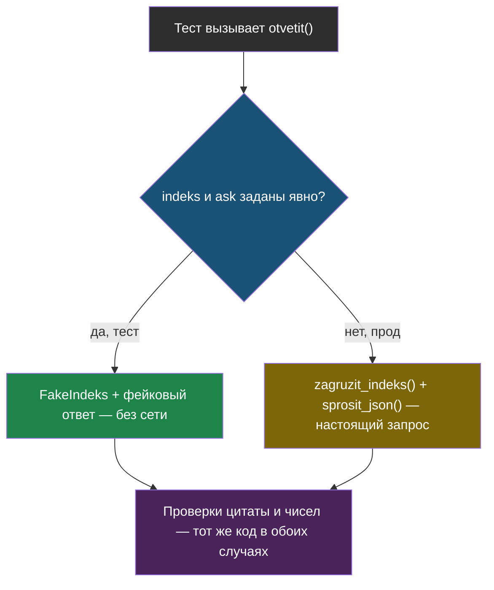

# Урок 1. FastAPI поверх RAG из модуля 6

> **Лабораторной с Colab в этом уроке нет.** Код живёт в отдельном репозитории —
> [ai-docs-course-bot](https://github.com/iRoboTron/ai-docs-course-bot) — его запускают
> и тестируют локально, а не в блокноте.

## Напомним, где мы остановились

Модуль 6 закончился связкой v6: поиск по смыслу, ответ с цитатой, проверка цитаты и
чисел кодом. 7 верных ответов из 8, единственный провал — честный ложный отказ.
Всё это работало в Colab: 30 с лишним ячеек, запуск сверху вниз, «протестировано»
значило «посмотрели на печать и она совпала с ожиданием».

## Почему ноутбук — не сервис

> **Сервис** — программа, которая отвечает на запрос независимо от того, кто и когда
> его прислал, и которую можно перезапустить без участия человека, читавшего код.

У ноутбука нет ни того, ни другого. Гостю сайта нельзя показать Colab; переменные
`client`, `KUSKI`, `VEKTORY` живут, пока жива сессия, и исчезают при перезапуске;
а «прогнать проверки» значит открыть блокнот и читать вывод глазами.

## Перенос без изменения логики

Правило простое: код модуля 6 не переписывается заново, а **раскладывается по
функциям**, которые можно вызвать без Jupyter. `proverit_citatu`, `proverit_chisla`,
`narezka_po_zagolovkam` переехали в `app/rag.py` дословно — тот же код, что в
`notebooks/modul6__01_citaty_i_kachestvo.py`, только не в ячейке, а в файле.

```python
def otvetit(vopros, indeks=None, ask=None):
    """v6 целиком (модуль 6, шаг 8), но как функция сервиса."""
    indeks = indeks or zagruzit_indeks()
    ask = ask or (lambda vopros, kuski: sprosit_json(klient(), vopros, kuski))

    kuski = indeks.nayti(vopros)
    if not kuski:
        return {"otvet": "Не знаю, уточните у оператора.", "istochnik": "", "proverki": "поиск пуст"}

    rezultat = ask(vopros, kuski)
    citata_ok, prichina = proverit_citatu(rezultat, kuski)
    chisla_ok, lishnie = proverit_chisla(rezultat, kuski)
    if not (citata_ok and chisla_ok):
        return {"otvet": "Не могу ответить уверенно, уточните у оператора.",
                "istochnik": "", "proverki": f"цитата: {citata_ok}, числа: {chisla_ok}"}
    return {**rezultat, "proverki": "пройдены"}
```

Единственное новое — параметры `indeks` и `ask` вместо глобальных переменных
ноутбука. Причина не архитектурная, а практическая: без них функцию нельзя
протестировать без сети и без ключа к модели.

## FastAPI: два эндпоинта

```python
@app.get("/health")
def health():
    return {"status": "ok"}


@app.post("/ask")
def ask(zapros: Vopros):
    return otvetit(zapros.vopros)
```

`/health` — чтобы было чем проверить, что процесс жив, до всякого RAG. `/ask` —
тот же `otvetit`, вызванный без подмены зависимостей: по умолчанию `indeks` и `ask`
настоящие.

## Тесты без сети и без модели

> **Тест без сети** — проверка, которая не обращается ни к прокси модели, ни к
> интернету, и потому одинаково проходит и на ноутбуке разработчика, и в CI.

Тесты подменяют `indeks` и `ask` на фейковые: индекс всегда отдаёт один и тот же
набор кусков, ответ модели задан заранее как обычный словарь.

```python
def test_ask_otkazyvaet_kogda_citata_pridumana():
    fake_indeks = FakeIndeks(KUSKI)
    fake_ask = lambda vopros, kuski: {
        "otvet": "Гарантия 3 месяца.", "citata": "выдуманная цитата",
        "istochnik": "garantiya.html#Гарантия"}
    rezultat = rag.otvetit("Какая гарантия?", indeks=fake_indeks, ask=fake_ask)
    assert "уточните" in rezultat["otvet"].lower()
```

Это тот же принцип, что и во всех проверках курса: правило можно уговорить только
там, где решает модель. Здесь решает `if not (citata_ok and chisla_ok)` — обычный
код, который выполняется одинаково что в тесте, что на сайте.



## CI: проверка на каждый коммит

> **CI** (по-английски *continuous integration*, непрерывная интеграция) — автоматический
> запуск тестов на каждый push, без участия человека.

```yaml
- run: pip install -r requirements-dev.txt
- run: AI_KEY=ci-fake-key PYTHONPATH=. pytest -q
```

`AI_KEY=ci-fake-key` — не настоящий ключ, а заглушка: раз тесты не ходят в сеть, им
всё равно, какой ключ стоит в переменной окружения, лишь бы код при импорте не упал
на отсутствии переменной. Если бы тесты дёргали настоящую модель, CI либо хранил бы
секрет, либо был бы нестабильным — оба варианта хуже, чем протестировать саму логику
отдельно от сети.

## Что мы узнали

- **Сервис** отвечает на запрос независимо от того, кто его прислал, и переживает
  перезапуск — ноутбук не может ни то, ни другое.
- Перенос кода из ноутбука в сервис не меняет логику, только раскладывает её по
  функциям, которые можно вызвать без Jupyter.
- Подмена зависимостей (`indeks`, `ask`) — не архитектурная прихоть, а способ
  протестировать код без сети и без ключа к модели.
- **CI** прогоняет тесты на каждый коммит автоматически; тесты для этого обязаны
  сами по себе не зависеть от сети.

## Проверь себя

1. Почему `otvetit()` принимает `indeks` и `ask` параметрами, а не берёт их из
   глобальных переменных, как было в ноутбуке?
2. Тест подменяет ответ модели заранее заданным словарём. Что именно он тогда
   проверяет — а что не проверяет вовсе?
3. Зачем в CI переменной `AI_KEY` присвоено заведомо неверное значение, а не
   настоящий ключ?
