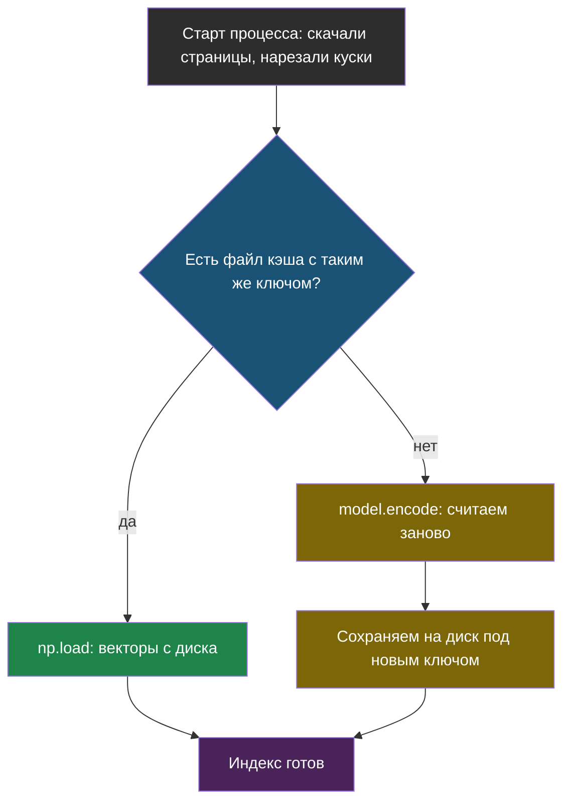

# Урок 2. Хранилище: что переживает перезапуск

> **Лабораторной с Colab в этом уроке тоже нет.** Код и тесты — в
> [ai-docs-course-bot](https://github.com/iRoboTron/ai-docs-course-bot), файл
> `app/storage.py`.

## Напомним, где мы остановились

Урок 1 дал сервис с `/ask` и тестами без сети. Но `zagruzit_indeks()` считает
эмбеддинги **при первом запросе** и держит их в памяти процесса — ровно то, что
делал ноутбук, только вместо перезапуска ячейки теперь перезапуск процесса.
При каждом деплое, каждом падении и перезапуске сервис снова качает страницы
сайта и заново прогоняет модель эмбеддингов по всем кускам.

## Три варианта, куда положить эмбеддинги

| Вариант | Что это | Когда достаточно | Когда мало |
|---|---|---|---|
| **Файл на диске** | `.npy`/`.json` рядом с процессом | Один процесс, один сервер, корпус небольшой | Несколько инстансов сервиса — каждый считает и хранит своё |
| **SQLite** | Файл базы данных, векторный поиск через расширение или Python | Нужны запросы и обновление отдельных кусков, всё ещё один сервер | Несколько серверов должны читать один и тот же индекс одновременно |
| **pgvector** | Расширение PostgreSQL для векторного поиска | Несколько инстансов сервиса делят один индекс, корпус растёт | Не нужен, пока хватает простого |

Курс идёт по этому же принципу, что и выбор RAG в модуле 5: **не гадать, а
попробовать самое простое и измерить, где оно перестаёт хватать.** Файл —
самый простой вариант; вот что он реально экономит.

## Файловый кэш: ключ по содержимому, а не по имени

Ключ кэша — хэш **текста** кусков, а не дата файла и не номер версии. Если сайт
поменялся, старый ключ просто не совпадёт, и кэш пересчитается сам, без
отдельного «срока годности».

```python
def klyuch_keshа(kuski):
    soderzhimoe = "\n".join(f"{k['istochnik']}|{k['tekst']}" for k in kuski)
    return hashlib.sha256(soderzhimoe.encode("utf-8")).hexdigest()[:16]


def zagruzit(kuski, put=CACHE_DIR):
    klyuch = klyuch_keshа(kuski)
    put_npy, put_json = put / f"{klyuch}.npy", put / f"{klyuch}.json"
    if not (put_npy.is_file() and put_json.is_file()):
        return None
    if json.loads(put_json.read_text(encoding="utf-8")) != kuski:
        return None  # хэш совпал, а содержимое нет — на всякий случай перепроверяем
    return np.load(put_npy)
```

> **Ключ кэша по содержимому** — идентификатор записи в кэше, вычисленный из
> самих данных, а не из внешних признаков вроде даты или версии.

`Indeks` теперь сначала спрашивает кэш и только при промахе зовёт модель:

```python
vektory_iz_kesha = storage.zagruzit(kuski)
if vektory_iz_kesha is not None:
    self.vektory = vektory_iz_kesha
else:
    self.vektory = self.emb.encode([...], normalize_embeddings=True)
    storage.sohranit(kuski, self.vektory)
```



## Честный замер: кэш экономит не то, что кажется

Первое предположение — «кэш уберёт задержку при перезапуске». Проверили на
реальном времени, а не на ощущении:

| Что мерили | Время |
|---|---|
| Загрузка модели эмбеддингов (`SentenceTransformer(...)`) | **9,4 с** |
| Кодирование 30 кусков (`model.encode(...)`) | **0,76 с** |

> **Холодный старт** — время от запуска процесса до готовности отвечать на
> первый настоящий запрос.

Загрузка **модели** — это девять секунд почти независимо от размера корпуса.
Кодирование кусков — меньше секунды даже на тридцати штуках, и именно эту часть
убирает файловый кэш. На корпусе нашего сайта (десятки кусков) кэш не решает
холодный старт: его всё равно съедает загрузка модели.

Кэш становится заметным при другом раскладе: корпус на тысячи кусков (кодирование
уже не доли секунды) или эмбеддинги считает **платный API**, а не локальная модель
(экономия — не только время, но и деньги за каждый вызов). Для нынешнего размера
сайта «Полярис» главный эффект кэша — не скорость, а то, что сервис не долбит
модель одними и теми же кусками при каждом рестарте зря.

## Когда переходить на SQLite или pgvector

Файла достаточно, пока сервис — один процесс на одном сервере. Переходить
раньше — усложнение без причины, тот же принцип, что YAGNI в выборе
инструментов (см. `notebooks-extra/`): не тащи библиотеку, пока не упёрся в
границу того, что есть.

**Переходить на SQLite**, когда нужен не только «взять всё разом», а частичные
обновления (один документ на сайте поменялся — пересчитать только его кусок) или
простые запросы к метаданным.

**Переходить на pgvector**, когда сервис перестаёт быть одним процессом: несколько
инстансов за балансировщиком должны видеть один и тот же индекс одновременно, а
файл на диске одного из них для остальных не существует.

## Что мы узнали

- Файловый кэш эмбеддингов переживает перезапуск процесса — ноутбучный вариант
  (эмбеддинги только в памяти) этого не может в принципе.
- **Ключ кэша по содержимому** избавляет от ручного отслеживания «протух — не
  протух»: изменились данные — изменился ключ.
- **Холодный старт** этого сервиса — это загрузка модели (9,4 с), а не
  кодирование кусков (0,76 с на 30 штук). Кэш экономит вторую часть, а не первую.
- SQLite и pgvector — не «лучше файла», а решение других задач: частичные
  обновления и общий индекс на несколько инстансов сервиса.

## Измени одну деталь

Открой `app/storage.py`, найди `sohranit` — строку
`json.dumps(kuski, ensure_ascii=False)`. Замени `kuski` на `kuski[0]` (на диск
сохранится только первый кусок вместо всего списка).

**Прежде чем запускать: как думаешь, что произойдёт — сервис упадёт с ошибкой
или просто перестанет пользоваться кэшем? Какой тест из `tests/test_storage.py`
это поймает?**

Проверка:

```bash
AI_KEY=fake PYTHONPATH=. pytest tests/test_storage.py -q
```

Упадёт `test_sohranit_i_zagruzit_daet_te_zhe_vektory`: на диске окажется
словарь (первый кусок) вместо списка всех кусков; при чтении
`kuski_iz_kesha != kuski` всегда истина (словарь никогда не равен списку), и
`zagruzit` всегда возвращает `None`.

Обрати внимание, чего **не** произошло: сервис не упал. Он просто каждый раз
считает эмбеддинги заново, как будто кэша нет вообще — на глаз это не отличить
от «кэш работает, но медленно». Ровно такие поломки без падения тест и должен
ловить первым, до продакшена. Верни `kuski` обратно, прежде чем читать дальше.

## Проверь себя

1. Почему ключ кэша строится из текста кусков, а не из даты последнего изменения
   файла на сайте?
2. Файловый кэш почти не ускорил холодный старт нашего сервиса. Значит ли это,
   что кэш был не нужен? Когда он даст реальный выигрыш?
3. Сервис нужно развернуть в двух инстансах за балансировщиком нагрузки. Что
   сломается у файлового кэша и почему?
