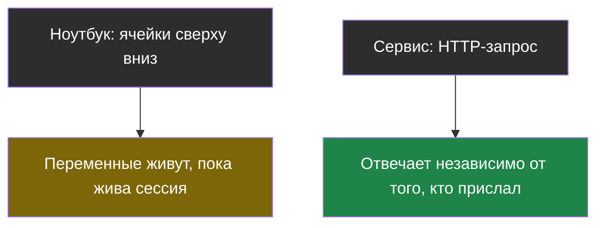
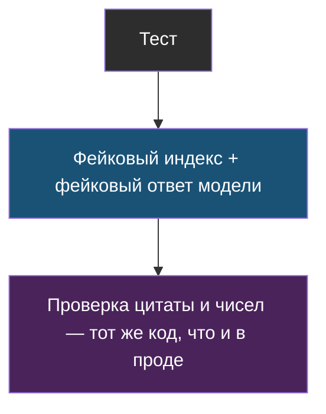
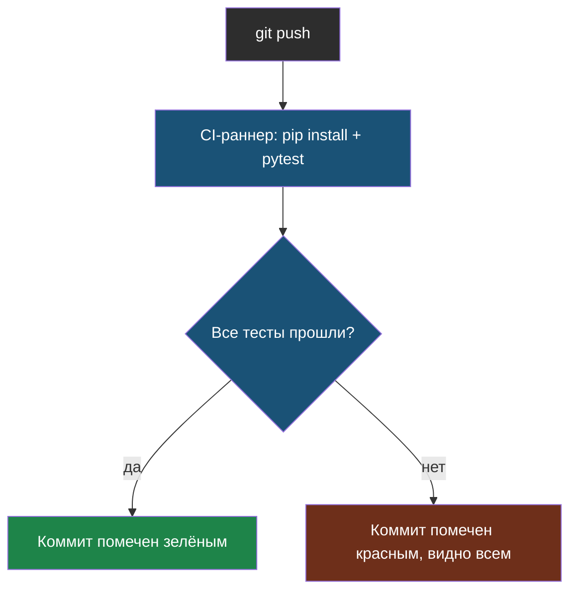

# Словарик модуля 7

Термины по алфавиту; названия латиницей — в конце.

## Сервис

> **Сервис** — программа, которая отвечает на запрос независимо от того, кто и когда
> его прислал, и которую можно перезапустить без участия человека, читавшего код.

Из [урока 1](chapter-01.md). Ноутбук не сервис: переменные живут, пока жива сессия
Colab, а «протестировано» значит «посмотрели на вывод глазами».

## Тест без сети

> **Тест без сети** — проверка, которая не обращается ни к прокси модели, ни к
> интернету, и потому одинаково проходит и у разработчика, и в CI.

Из [урока 1](chapter-01.md). Достигается подменой зависимостей: `otvetit()`
принимает `indeks` и `ask` параметрами, тест подставляет фейковые.

## CI (continuous integration)

> **CI** — автоматический запуск тестов на каждый push, без участия человека.

Из [урока 1](chapter-01.md). Работает только потому, что тесты не зависят от сети:
CI-раннер не имеет доступа к прокси модели курса и не должен его требовать.

