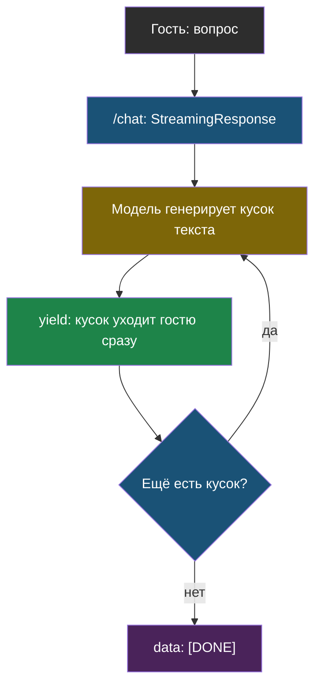

# Урок 1. Поток и виджет

> **Лабораторной с Colab в этом уроке нет.** Код — в
> [ai-docs-course-bot](https://github.com/iRoboTron/ai-docs-course-bot),
> `app/chat.py`, `static/widget.html`.

## Напомним, где мы остановились

Модуль 7 дал `/ask`: гость спрашивает — сервис молчит несколько секунд, пока
модель, поиск и все проверки не отработают целиком, — и только потом
показывает готовый ответ. Для проверенного факта с цитатой это правильно:
показывать непроверенный кусок ответа нельзя, он может не пройти проверку.
Но для живого диалога на сайте («расскажите подробнее», «а что насчёт…») это
слишком медленно и слишком строго.

## Поток вместо одного большого ответа

> **Потоковый ответ** — ответ, который приходит частями по мере того, как
> модель их генерирует, а не целиком после полной генерации.

Про это уже было в модуле 2 — там поток читали прямо из ответа OpenAI в
ноутбуке. Разница здесь — поток нужно **передать по HTTP** гостю, а не просто
напечатать в консоли.

```python
def poток_otveta(vopros, client_=None):
    client_ = client_ or klient()
    potok = client_.chat.completions.create(
        model=MODEL, temperature=0, max_tokens=300, stream=True,
        messages=[{"role": "system", "content": PRAVILA_CHAT},
                  {"role": "user", "content": vopros}])
    for kusok in potok:
        if kusok.choices and kusok.choices[0].delta.content:
            yield kusok.choices[0].delta.content
```

`if kusok.choices and ...` — не случайная осторожность: некоторые провайдеры
шлют финальный кусок потока вовсе без вариантов ответа (`choices` пуст). Без
этой проверки код упадёт на последнем кусочке каждого потока.

## SSE: формат для потока по HTTP

> **SSE** (по-английски *server-sent events*) — простой текстовый формат
> потокового HTTP-ответа: каждое событие — строка `data: ...`, отделённая
> пустой строкой.

```python
@app.post("/chat")
def chat_endpoint(zapros: ChatZapros):
    def sobytiya():
        for kusok in chat.poток_otveta(zapros.session_id, zapros.vopros):
            yield f"data: {json.dumps({'tekst': kusok}, ensure_ascii=False)}\n\n"
        yield "data: [DONE]\n\n"
    return StreamingResponse(sobytiya(), media_type="text/event-stream")
```

`StreamingResponse` в FastAPI — обычный генератор Python, обёрнутый в HTTP-
ответ: как только `yield` отдал строку, она уходит в сеть, не дожидаясь
следующих кусков.



## Виджет: минимальный клиент потока

`static/widget.html` — не готовый чат-компонент, а самое простое, что читает
поток: `fetch` + `ReadableStream`, без библиотек.

```javascript
const otvet = await fetch('/chat', {
  method: 'POST', headers: { 'content-type': 'application/json' },
  body: JSON.stringify({ session_id: sessionId, vopros }),
});
const chitatel = otvet.body.getReader();
// читаем чанки, разбираем по 'data: ... \n\n', как только пришли — в DOM
```

Ключевая разница с `EventSource` (стандартным способом читать SSE в браузере):
`EventSource` умеет только `GET`-запросы, а вопрос гостя мы отправляем телом
`POST`-запроса — значит, разбираем поток руками.

## Что мы узнали

- **Потоковый ответ** снижает не общее время ответа, а время **до первого
  символа на экране** — тот же вывод, что уже был в модуле 2, только теперь
  применённый к HTTP, а не к консоли ноутбука.
- **SSE** — простой текстовый формат: `data: ...` и пустая строка, ничего
  сложнее.
- `/chat` и `/ask` — разные инструменты: `/chat` для живого разговора без
  проверки цитат, `/ask` — для факта с источником. Не пытаемся заменить одно
  другим.
- Проверка `if kusok.choices and ...` — не лишняя строчка: без неё поток падает
  на последнем куске у части провайдеров.

## Измени одну деталь

Открой `app/chat.py`, найди строку
`if kusok.choices and kusok.choices[0].delta.content:` в `poток_otveta`. Убери
часть `kusok.choices and`, оставь только `if kusok.choices[0].delta.content:`.

**Прежде чем запускать: что, по-твоему, произойдёт на потоке, где последний
кусок приходит без вариантов ответа?**

Проверка:

```bash
AI_KEY=fake PYTHONPATH=. pytest tests/test_chat.py -q
```

Упадёт `test_potok_otveta_propuskaet_pustye_kuski` с `IndexError: list index
out of range` — ровно на том куске, где `choices` оказался пустым списком.
Тест намеренно подсовывает такой кусок, потому что реальные провайдеры иногда
его присылают: без проверки код обвалит весь поток из-за одного финального
служебного кусочка. Верни `kusok.choices and` обратно, прежде чем читать
дальше.

## Проверь себя

1. Почему `/chat` не проверяет цитаты и числа ответа, как это делает `/ask`?
   Разве это не риск, что бот что-то выдумает?
2. `EventSource` — стандартный способ читать SSE в браузере, но виджет его не
   использует. Почему?
3. Поток снижает время до первого символа на экране. Меняется ли при этом
   **общее** время генерации ответа?
