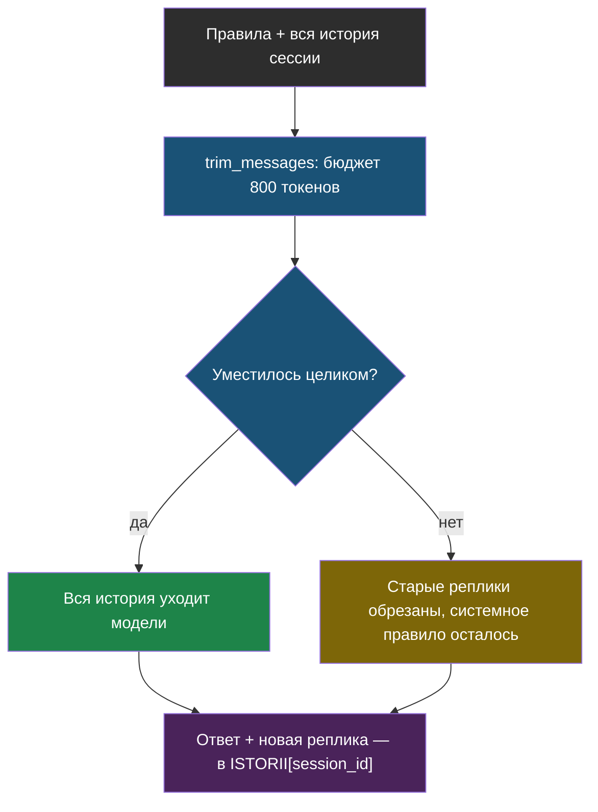

# Урок 2. Память диалога через LangChain

> **Лабораторной с Colab в этом уроке нет.** Код — в
> [ai-docs-course-bot](https://github.com/iRoboTron/ai-docs-course-bot),
> `app/chat.py`.

## Напомним, где мы остановились

Урок 1 дал поток: гость видит ответ по мере генерации. Но каждый вопрос
по-прежнему независим — задай уточняющий вопрос «а сколько это в рублях?», и
бот не поймёт, о чём вообще речь: он не видел предыдущего сообщения.

## Зачем здесь библиотека, а не свой список

Самое простое решение — копить сообщения в списке. Но список без предела
растёт с каждой репликой, и рано или поздно упрётся в лимит контекста модели
(модуль 3 уже показал: весь диалог в каждом запросе — дорого и в какой-то
момент невозможно). Значит, нужно не просто хранить историю, а **обрезать**
её по бюджету — оставлять самые свежие сообщения, а не тащить всё подряд.

Именно эту задачу — память и сжатие контекста — в `TODO.md` курса заранее
выбрали закрывать библиотекой `LangChain`: писать свой алгоритм обрезки можно,
но библиотека уже даёт готовую функцию с понятными параметрами, и это ровно
тот случай, когда не переизобретать разумно.

```python
from langchain_core.messages import AIMessage, HumanMessage, SystemMessage
from langchain_core.messages.utils import count_tokens_approximately, trim_messages
from langchain_openai import ChatOpenAI
```

## Обрезка истории по бюджету токенов

> **Обрезка истории** (по-английски *trimming*) — удаление самых старых
> сообщений диалога, когда общий размер истории превышает заданный бюджет.

```python
MAX_TOKENS_ISTORII = 800

def obrezat_istoriyu(soobshcheniya, max_tokens=MAX_TOKENS_ISTORII):
    return trim_messages(
        soobshcheniya, strategy="last", token_counter=count_tokens_approximately,
        max_tokens=max_tokens, start_on="human", include_system=True)
```

На примере: системное правило + пять реплик разговора (сначала про субботу,
потом про воскресенье, потом про гарантию), бюджет — 50 токенов.

```python
>>> obrezat_istoriyu(istoriya, max_tokens=50)
[SystemMessage("Ты помощник..."), HumanMessage("А в воскресенье?"),
 AIMessage("В воскресенье мы не работаем."), HumanMessage("Какая у вас гарантия на ремонт?")]
```

Самый старый обмен — про субботу — обрезан целиком. Системное правило
(`include_system=True`) остаётся всегда: без него бот забудет, кто он, после
первой же обрезки.



## Память по сессии

```python
ISTORII = defaultdict(list)  # session_id -> список сообщений

def poток_otveta(session_id, vopros, model_factory=None):
    model_factory = model_factory or llm
    ISTORII[session_id].append(HumanMessage(vopros))
    soobshcheniya = obrezat_istoriyu([PRAVILA_CHAT] + ISTORII[session_id])

    kuski = []
    for chast in model_factory().stream(soobshcheniya):
        if chast.content:
            kuski.append(chast.content)
            yield chast.content
    ISTORII[session_id].append(AIMessage("".join(kuski)))
```

`ISTORII` — словарь в памяти процесса, тот же приём, что с индексом кусков в
модуле 7: работает для одного процесса на одном сервере. Несколько инстансов
сервиса за балансировщиком не будут видеть историю друг друга — общее
хранилище (Redis, база) понадобится в модуле 9, там же, где обсуждаются
лимиты и резервная модель.

## Что мы узнали

- **Обрезка истории** — не «забыть всё», а оставить свежее и уложиться в
  бюджет токенов; без неё длинный диалог рано или поздно упрётся в лимит
  контекста модели, как весь сайт в модуле 3.
- `trim_messages` из LangChain закрывает ровно ту задачу, ради которой
  библиотеку выбрали заранее (`TODO.md`) — не любой ценой использовать
  библиотеку, а под конкретную проблему модуля.
- Память диалога живёт по `session_id` в памяти процесса — тот же ограниченный
  приём, что файловый кэш индекса в модуле 7, с тем же пределом (один процесс).

## Измени одну деталь

Открой `app/chat.py`, найди вызов `trim_messages` внутри `obrezat_istoriyu`.
Замени `include_system=True` на `include_system=False`.

**Прежде чем запускать: что, по-твоему, произойдёт с системным правилом при
обрезке длинной истории?**

Проверка:

```bash
AI_KEY=fake PYTHONPATH=. pytest tests/test_chat.py -q
```

Упадёт `test_obrezat_istoriyu_ostavlyaet_svezhie_soobshcheniya`: вместо
`"Правила"` первым сообщением после обрезки окажется случайная реплика
диалога — системное правило просто выбросило вместе со старыми сообщениями.
На практике это означало бы, что после нескольких реплик бот забывает
инструкции, кто он и как отвечать, — не потому что «испортился», а потому что
их обрезали как обычное старое сообщение. Верни `include_system=True`
обратно, прежде чем читать дальше.

## Проверь себя

1. Почему обрезка отдаёт предпочтение **новым** сообщениям, а не старым?
2. Что произойдёт с диалогом, если несколько инстансов сервиса окажутся за
   одним балансировщиком нагрузки — увидят ли они одну и ту же историю сессии?
3. `MAX_TOKENS_ISTORII = 800` — если поднять это число в десять раз, что
   выиграет диалог и чем за это придётся заплатить?
