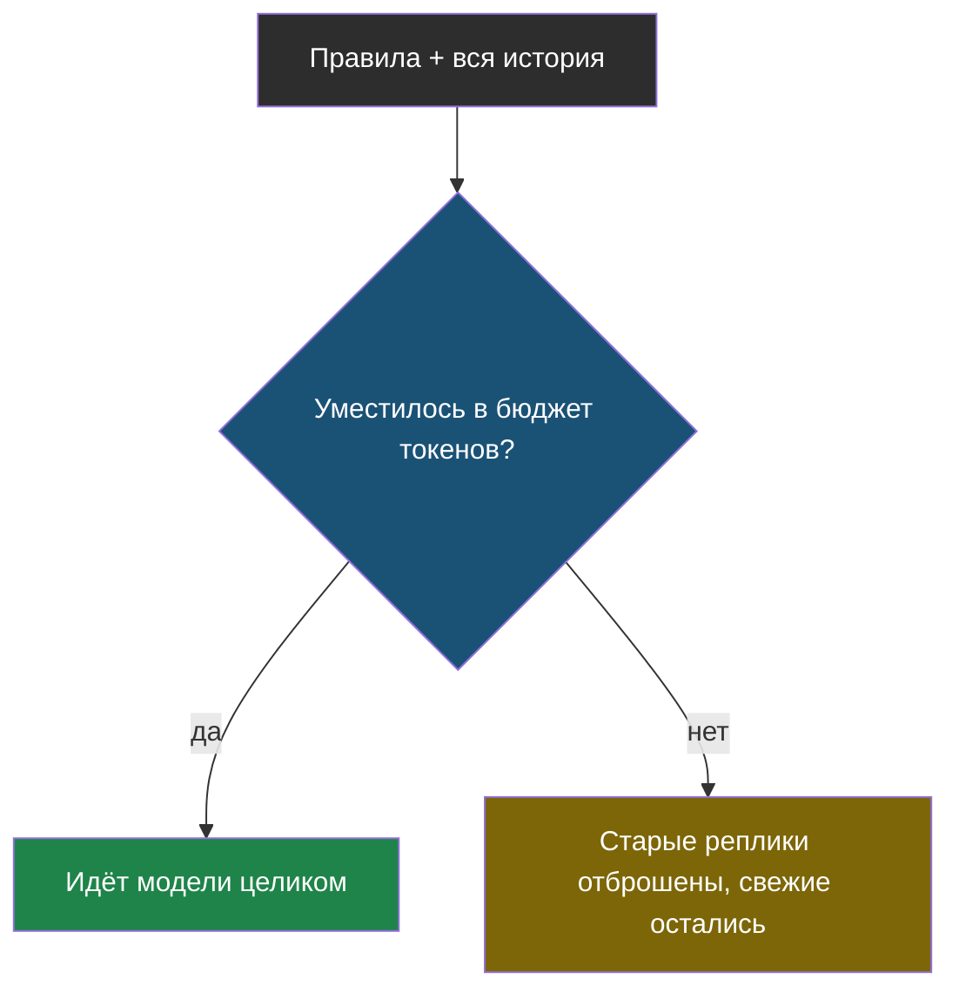
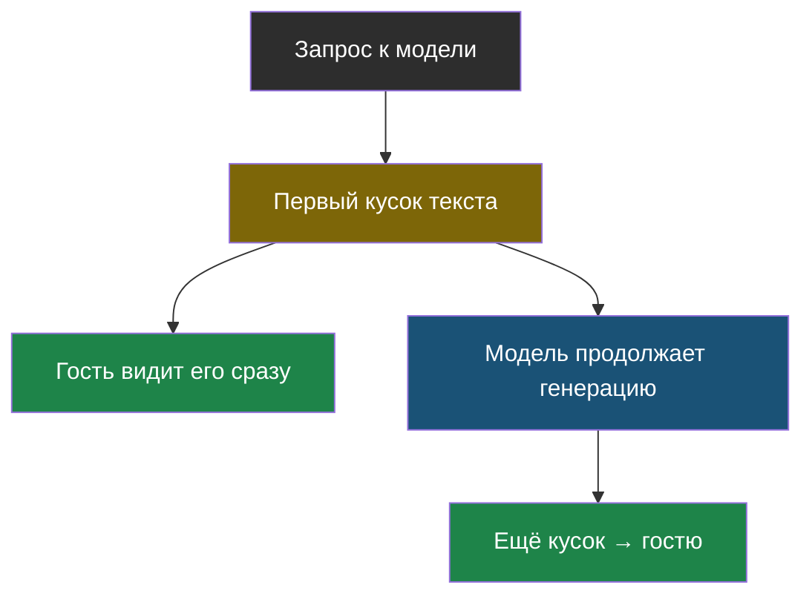
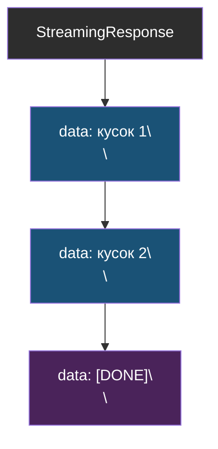

# Словарик модуля 8

Термины по алфавиту; названия латиницей — в конце.

## Обрезка истории

> **Обрезка истории** (по-английски *trimming*) — удаление самых старых
> сообщений диалога, когда общий размер истории превышает заданный бюджет.

Из [урока 2](chapter-02.md). Свежие сообщения остаются, самые старые уходят
первыми; системное правило можно закрепить, чтобы не обрезалось никогда.

## Потоковый ответ

> **Потоковый ответ** — ответ, который приходит частями по мере того, как
> модель их генерирует, а не целиком после полной генерации.

Из [урока 1](chapter-01.md). Снижает не общее время ответа, а время до первого
символа на экране.

## SSE (server-sent events)

> **SSE** — простой текстовый формат потокового HTTP-ответа: каждое событие —
> строка `data: ...`, отделённая пустой строкой.

Из [урока 1](chapter-01.md). Проще WebSocket: только сервер → клиент, без
отдельного протокола рукопожатия, читается любым HTTP-клиентом.

