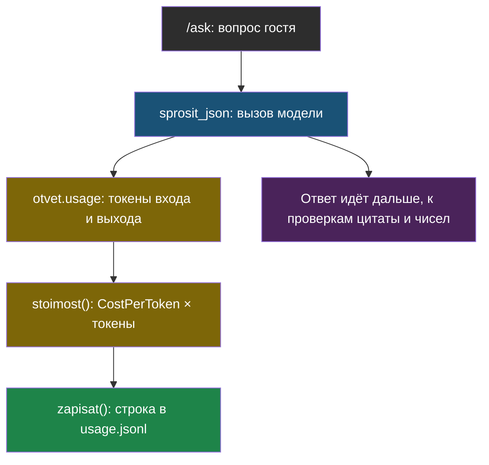

# Урок 1. Журнал и стоимость

> **Лабораторной с Colab в этом уроке нет.** Код — в
> [ai-docs-course-bot](https://github.com/iRoboTron/ai-docs-course-bot),
> `app/observability.py`.

## Напомним, где мы остановились

Модуль 8 дал `/chat` с памятью. И `/ask`, и `/chat` зовут модель, но ни один
не оставляет следа: сколько вызовов было сегодня, сколько токенов и во
сколько это встало — неизвестно, пока не спросят прямо.

## Зачем библиотека, а не свой счётчик

Посчитать токены и умножить на цену — пять строк. Но `TODO.md` курса ещё на
этапе планирования части 2 закрепил за этой задачей **LiteLLM**: у неё уже
есть каталог цен на сотни моделей и функция `completion_cost`, которая берёт
готовый ответ модели и сама достаёт из него токены. Пять строк не стоят того,
чтобы их писать самим, когда библиотека уже умеет ровно это.

## Честная деталь: каталог цен LiteLLM не знает наш прокси

Первая попытка — вызвать `completion_cost` без указания цены — не сработала:

```
Exception: This model isn't mapped yet. model=openai/qwen/qwen3.7-flash,
custom_llm_provider=openai.
```

Ничего не поломано: у LiteLLM есть каталог цен на **настоящие** модели у
настоящих провайдеров, а `qwen/qwen3.7-flash` на прокси курса — это имя
модели у **нашего** прокси, а не у OpenRouter или Alibaba напрямую. Каталог
просто не знает, что это за модель. Решение — не искать цену в каталоге, а
задать её явно:

```python
from litellm.types.utils import CostPerToken

CENA_VHODA = 0.03 / 1_000_000   # $ за токен
CENA_VYHODA = 0.15 / 1_000_000  # $ за токен

def stoimost(otvet):
    cena = CostPerToken(input_cost_per_token=CENA_VHODA, output_cost_per_token=CENA_VYHODA)
    return litellm.completion_cost(
        completion_response=otvet, model=otvet.model, custom_cost_per_token=cena)
```

> **CostPerToken** — явно заданная цена входного и выходного токена, которую
> `completion_cost` использует вместо поиска в собственном каталоге.

Числа 0,03 и 0,15 доллара за миллион токенов — те же, что у прокси курса
`ai9.adelfos.ru` (комментарий в его собственном коде): дешёвые платные модели
через OpenRouter стоят именно в этом диапазоне.

## Считаем на примере

2 000 000 входных токенов и 1 000 000 выходных:

```
2 000 000 × 0,03 / 1 000 000 = 0,06 $   (вход)
1 000 000 × 0,15 / 1 000 000 = 0,15 $   (выход)
итого: 0,21 $
```

Обратите внимание: цена **не поровну**. Выходной токен стоит в пять раз
дороже входного — это не опечатка в примере, а обычная практика провайдеров:
генерация дороже чтения.

## Журнал: одна строка на вызов

```python
def zapisat(endpoint, vopros, otvet, nachalo, put=LOG_PATH):
    zapis = {
        "ts": time.time(), "endpoint": endpoint, "vopros_simvolov": len(vopros),
        "prompt_tokens": otvet.usage.prompt_tokens,
        "completion_tokens": otvet.usage.completion_tokens,
        "stoimost_usd": stoimost(otvet), "sekund": round(time.time() - nachalo, 3),
    }
    with put.open("a", encoding="utf-8") as f:
        f.write(json.dumps(zapis, ensure_ascii=False) + "\n")
    return zapis
```

Формат — `jsonl`: одна строка — один JSON-объект. Не общий массив в одном
файле, который пришлось бы целиком перечитывать и переписывать на каждой
записи — просто дописываем строку в конец.

`zapisat` вызывается прямо внутри `sprosit_json` (модуль 6-7) — одна строка
добавлена в уже существующую функцию, контракт возврата не поменялся:

```python
def sprosit_json(client, vopros, kuski, pravila=PRAVILA_V6, model=MODEL):
    nachalo = time.perf_counter()
    dannye = "\n\n".join(...)
    otvet = client.chat.completions.create(...)
    observability.zapisat("ask", vopros, otvet, nachalo)   # новая строка
    syroy = (otvet.choices[0].message.content or "").strip()
    ...
```



## Что мы узнали

- **CostPerToken** решает проблему, которую каталог цен LiteLLM не может: имя
  модели на чужом прокси ему ничего не говорит, цену нужно задать явно.
- Входной и выходной токен стоят по-разному — при подсчёте это не мелочь,
  разница в разы.
- Журнал — `jsonl`: одна строка на событие, ничего не перечитываем и не
  переписываем при добавлении.
- Логирование встроено в уже существующую функцию одной строкой — контракт
  возврата не изменился, старые тесты (с фейковым `ask()`) его не касаются.

## Измени одну деталь

Открой `app/observability.py`, найди `stoimost()` — строку `cena =
CostPerToken(input_cost_per_token=CENA_VHODA, output_cost_per_token=CENA_VYHODA)`.
Поменяй местами `CENA_VHODA` и `CENA_VYHODA`.

**Прежде чем запускать: изменится ли результат теста, если в вопросе и
ответе было бы поровну токенов? А если не поровну?**

Проверка:

```bash
AI_KEY=fake PYTHONPATH=. pytest tests/test_observability.py -q
```

Упадёт `test_stoimost_schitaetsya_po_faktcheskim_tokenam`: вместо 0,21 $
получится 0,33 $. Тест специально считает на **разном** числе входных и
выходных токенов (2 млн и 1 млн) — на равных числах перепутанные местами
цены дали бы одинаковый результат, и ошибку никто бы не заметил. Верни
`CENA_VHODA`/`CENA_VYHODA` обратно, прежде чем читать дальше.

## Проверь себя

1. Почему `completion_cost` не смог сам найти цену модели `qwen/qwen3.7-flash`,
   хотя эта модель реально существует и её вызовы стоят денег?
2. Почему журнал хранится построчно (`jsonl`), а не одним большим JSON-массивом?
3. Тест на стоимость намеренно берёт разное число входных и выходных токенов.
   Что бы он не поймал, будь числа одинаковыми?
