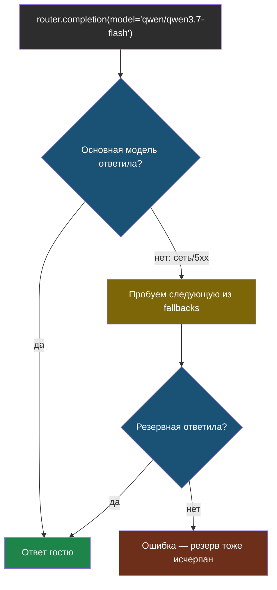

# Урок 2. Лимиты и резервная модель

> **Лабораторной с Colab в этом уроке нет.** Код — в
> [ai-docs-course-bot](https://github.com/iRoboTron/ai-docs-course-bot),
> `app/limits.py`.

## Напомним, где мы остановились

Урок 1 дал журнал и стоимость: теперь видно, сколько стоил каждый ответ. Но
два вопроса остаются без ответа: что будет, если один гость пришлёт сто
сообщений подряд, и что случится, если основная модель на прокси откажет.

## Лимит: скользящее окно по сессии

> **Скользящее окно** — способ считать «сколько было за последнюю минуту»:
> храним времена последних запросов, при каждой проверке выбрасываем те, что
> старше окна, и смотрим, сколько осталось.

```python
ZAPROSY = defaultdict(deque)

def prevysen_limit(session_id, seychas=None, max_zaprosov=MAX_ZAPROSOV_V_MINUTU, okno=OKNO_SEKUND):
    seychas = seychas if seychas is not None else time.time()
    ochered = ZAPROSY[session_id]
    while ochered and seychas - ochered[0] > okno:
        ochered.popleft()
    if len(ochered) >= max_zaprosov:
        return True
    ochered.append(seychas)
    return False
```

На примере: лимит 3 запроса в минуту, `session_id="s1"`.

| Запрос № | Время | В очереди до проверки | Результат |
|---|---|---|---|
| 1 | 1000 с | [] | не превышен, добавлен |
| 2 | 1000 с | [1000] | не превышен, добавлен |
| 3 | 1000 с | [1000, 1000] | не превышен, добавлен |
| 4 | 1000 с | [1000, 1000, 1000] | **превышен** — в очереди уже 3 |
| 4 (повтор) | 1061 с | [1000, 1000, 1000] | старые времена (1000) вне окна в 60 с — вычищены, не превышен |

Это не своя выдумка вместо библиотеки: `ZAPROSY` — простой словарь в памяти
процесса, тот же ограниченный приём, что файловый кэш индекса в модуле 7 и
история диалога в модуле 8. Работает для одного процесса; несколько
инстансов сервиса за балансировщиком лимит друг друга не увидят — для этого
нужно общее хранилище (Redis), тот же вывод, что уже звучал дважды.

`/chat` теперь отдаёт `429`, если лимит превышен:

```python
@app.post("/chat")
def chat_endpoint(zapros: ChatZapros):
    if prevysen_limit(zapros.session_id):
        raise HTTPException(429, "Слишком много сообщений подряд, подождите минуту.")
    ...
```

## Резервная модель: LiteLLM Router

Прокси курса `ai9.adelfos.ru` уже делает это на своей стороне — если
основная модель отказала, пробует следующую из списка (мы разбирали его код,
когда чинили доступ к прокси). `Router` из LiteLLM даёт тот же паттерн, но
на стороне **своего** приложения — полезно, когда сам прокси не под вашим
контролем или нужно видеть, какая модель реально ответила.

```python
def postroit_router(modeli=MODELI_PROKSI):
    model_list = [{
        "model_name": model,
        "litellm_params": {"model": f"openai/{model}", "api_base": BASE_URL, "api_key": API_KEY},
    } for model in modeli]
    fallbacks = [{modeli[0]: modeli[1:]}] if len(modeli) > 1 else []
    return Router(model_list=model_list, fallbacks=fallbacks, num_retries=0)
```

`model="openai/qwen/qwen3.7-flash"` — префикс `openai/` обязателен: без него
LiteLLM не поймёт, к какому провайдеру обращаться, и упадёт с `LLM Provider
NOT provided` ещё до первого запроса.



Проверили вживую (без сети — подменили сам `litellm.completion`, как и во
всех тестах курса): основная модель отвечает ошибкой сети, роутер сам
переходит на резервную, и это видно по порядку вызовов —
`openai/qwen/qwen3.7-flash` → `openai/google/gemma-3-12b-it`.

## Что мы узнали

- **Скользящее окно** считает лимит не абсолютным счётчиком, а по времени:
  старые запросы сами выпадают, отдельного сброса не нужно.
- Лимит и история диалога (модуль 8) и кэш индекса (модуль 7) — три места
  с одним и тем же ограничением: работают для одного процесса, не для
  нескольких инстансов сервиса без общего хранилища.
- `Router` из LiteLLM — тот же паттерн fallback, что уже видели на прокси
  курса, только на стороне своего приложения.
- Обязательный префикс провайдера (`openai/...`) в имени модели для LiteLLM —
  не опечатка, а требование библиотеки понять, к кому обращаться.

## Измени одну деталь

Открой `app/limits.py`, найди `prevysen_limit` — строку `if len(ochered) >=
max_zaprosov:`. Замени `>=` на `>`.

**Прежде чем запускать: при лимите 3 запроса в минуту, на каком по счёту
запросе теперь сработает блокировка — на 3-м, как раньше, или на другом?**

Проверка:

```bash
AI_KEY=fake PYTHONPATH=. pytest tests/test_limits.py -q
```

Упадут два теста сразу — `test_prevysen_limit_propuskaet_poka_ne_dostignut_potolok`
и `test_prevysen_limit_sessii_ne_delyat_schyotchik`, оба по одной причине:
при лимите 3 после трёх запросов в очереди уже три записи, а `3 > 3` — ложь,
значит четвёртый запрос **тоже** пройдёт. Лимит «3 в минуту» стал лимитом
«4 в минуту» — на единицу мягче, чем задумано. Классическая ошибка на
границе: `>=` и `>` выглядят почти одинаково, а меняют смысл ровно на одно
разрешённое действие. Верни `>=` обратно, прежде чем читать дальше.

## Проверь себя

1. Почему `ZAPROSY` — `defaultdict(deque)`, а не обычный список чисел?
2. Router и лимит по сессии оба хранят состояние в памяти процесса. Что
   изменится, если сервис развернуть в трёх инстансах за балансировщиком?
3. Почему модель в `litellm_params` записана как `f"openai/{model}"`, а не
   просто именем модели?
