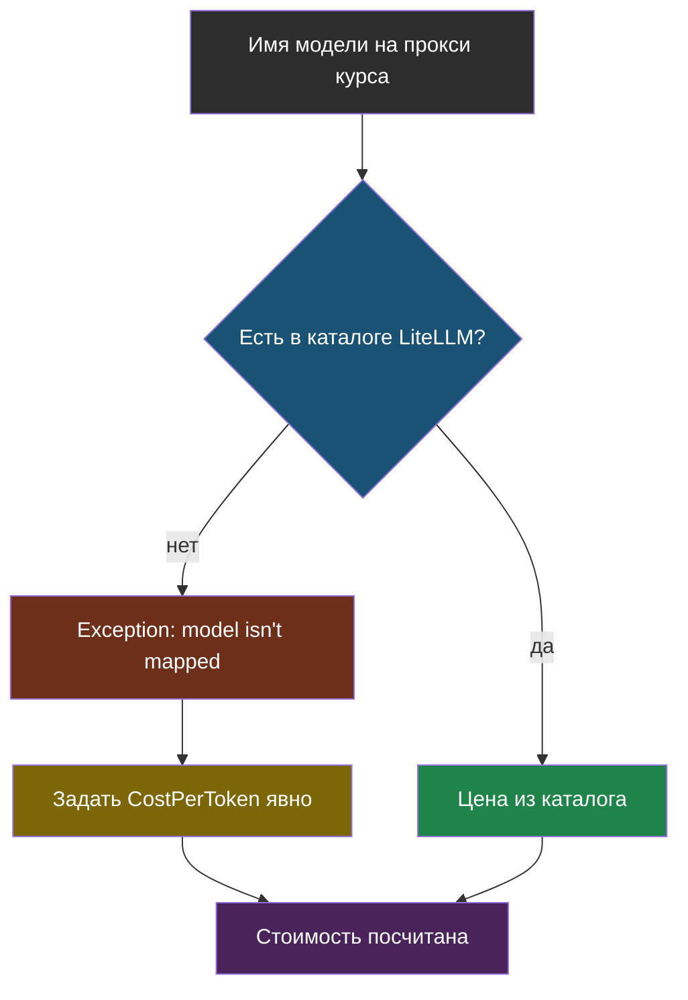

# Словарик модуля 9

Термины по алфавиту; названия латиницей — в конце.

## CostPerToken

> **CostPerToken** — явно заданная цена входного и выходного токена,
> которую `completion_cost` использует вместо поиска в собственном каталоге.

Из [урока 1](chapter-01.md). Нужен, когда модель — не «настоящая» модель
известного провайдера, а имя на чужом прокси, которого нет в каталоге цен
LiteLLM.

