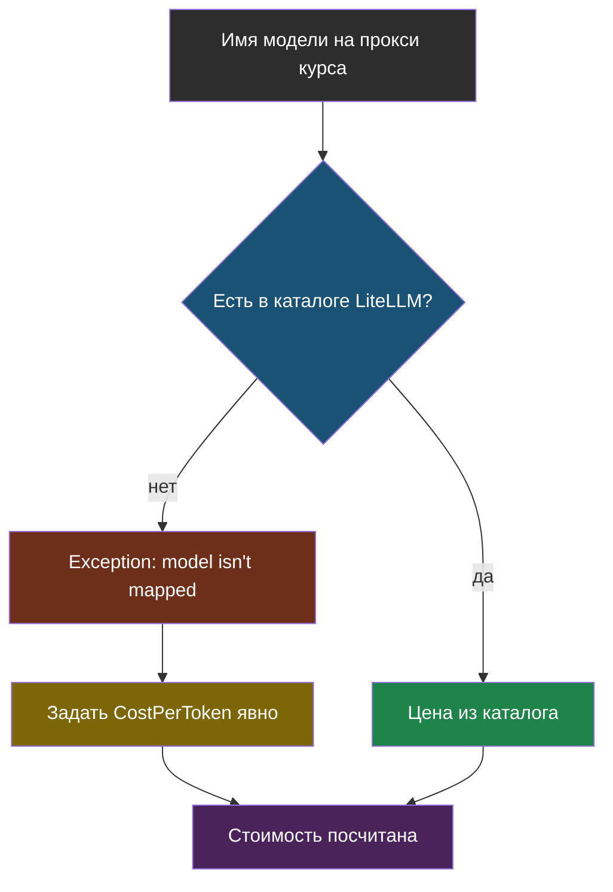
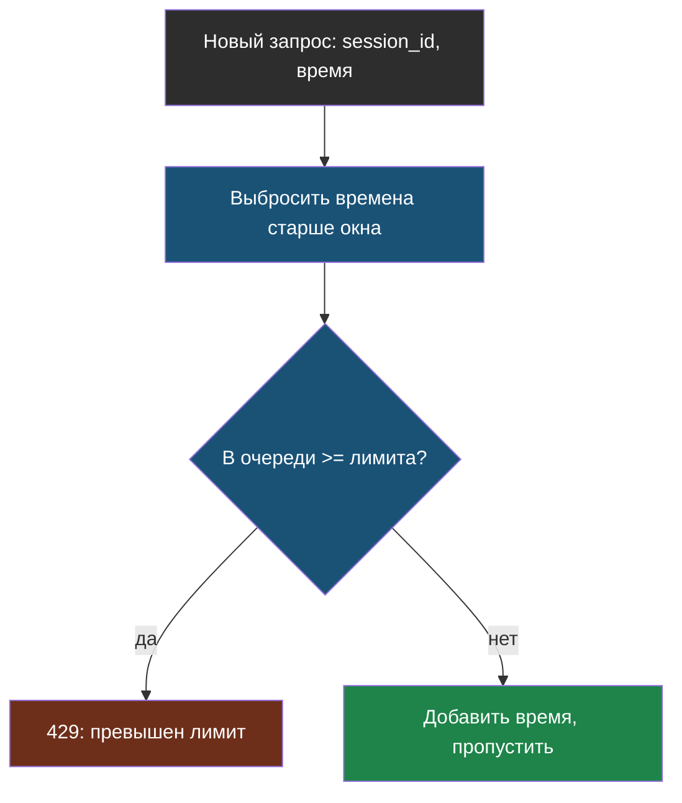
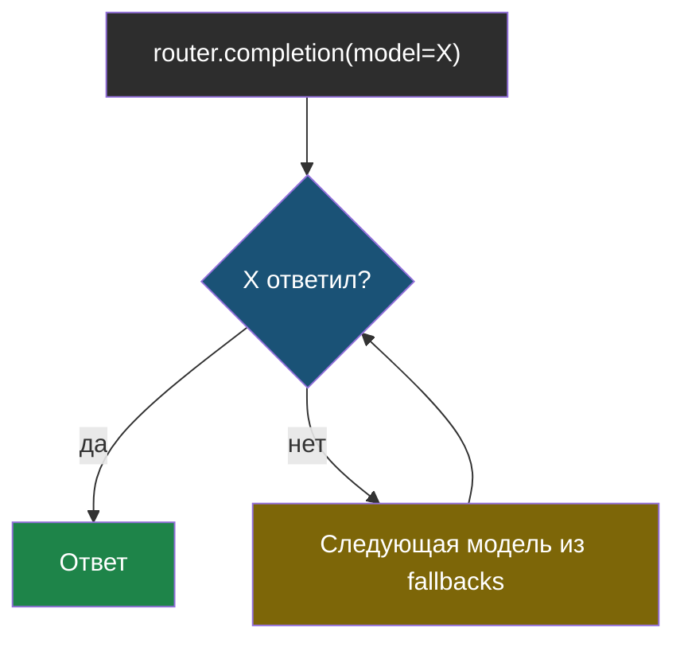

# Словарик модуля 9

Термины по алфавиту; названия латиницей — в конце.

## CostPerToken

> **CostPerToken** — явно заданная цена входного и выходного токена,
> которую `completion_cost` использует вместо поиска в собственном каталоге.

Из [урока 1](chapter-01.md). Нужен, когда модель — не «настоящая» модель
известного провайдера, а имя на чужом прокси, которого нет в каталоге цен
LiteLLM.

## Скользящее окно

> **Скользящее окно** — способ считать «сколько было за последнюю минуту»:
> храним времена последних запросов, при каждой проверке выбрасываем те, что
> старше окна, и смотрим, сколько осталось.

Из [урока 2](chapter-02.md). Не нужен отдельный сброс счётчика — старые
запросы сами выпадают из окна со временем.

## Router (LiteLLM)

> **Router** — обёртка LiteLLM, которая при отказе одной модели сама
> переходит на следующую из заданного списка (`fallbacks`).

Из [урока 2](chapter-02.md). Тот же паттерн, что уже реализован вручную на
прокси курса (`ai9-proxy`), только на стороне своего приложения.

