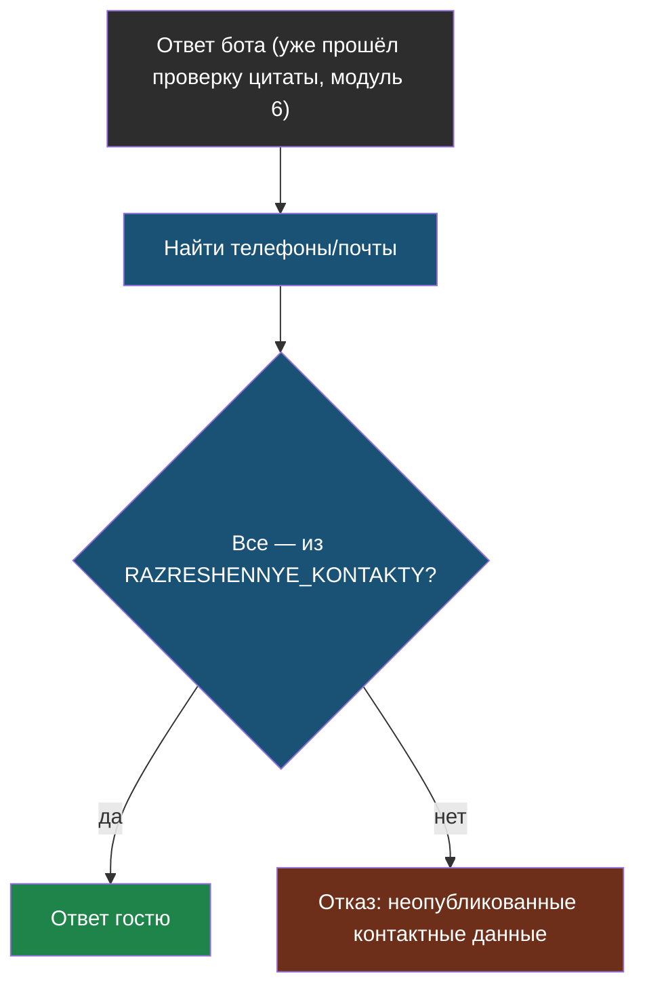

# Урок 2. Персональные данные и деплой

> **Лабораторной с Colab в этом уроке нет.** Код — в
> [ai-docs-course-bot](https://github.com/iRoboTron/ai-docs-course-bot),
> `app/guard.py`.

## Напомним, где мы остановились

Урок 1 закрыл вход: вопрос гостя проверяется на подмену инструкций до RAG.
Осталась вторая сторона — выход. Если в найденных документах случайно
окажется что-то личное, а не только цены и часы работы, бот это честно
процитирует — цитата ведь дословная (модуль 6), значит «правильная».

## Наивная проверка ломает законный ответ

Первая идея — искать в ответе всё, что похоже на телефон или почту, и
блокировать. У сайта «Полярис» (`kontakty.html`) есть свой, полностью
законный телефон и почта:

```
Телефон: +7 (999) 000-00-00. Почта: help@polaris-service.example.
```

Наивная проверка «похоже на телефон → блокируем» заблокирует **и** ответ на
законный вопрос «как с вами связаться?» — там ведь тоже есть номер, похожий
на телефон. Нельзя просто искать паттерн, нужно знать, какие контакты уже
публичные, а какие — нет.

## Проверка с разрешённым списком

```python
PATTERN_TELEFON = re.compile(r"(?:\+7|8)[\s\-]?\(?\d{3}\)?[\s\-]?\d{3}[\s\-]?\d{2}[\s\-]?\d{2}")
PATTERN_EMAIL = re.compile(r"[\w.+-]+@[\w.-]+\.\w+")

RAZRESHENNYE_KONTAKTY = {"+7 (999) 000-00-00", "help@polaris-service.example"}

@register_validator(name="net-neizvestnyh-dannyh", data_type="string")
class NetNeizvestnyhDannyh(Validator):
    def _validate(self, value, metadata):
        naydennoe = PATTERN_TELEFON.findall(value) + PATTERN_EMAIL.findall(value)
        neizvestnoe = [n for n in naydennoe if n not in RAZRESHENNYE_KONTAKTY]
        if neizvestnoe:
            return FailResult(error_message=f"в ответе неопубликованные контактные данные: {neizvestnoe}")
        return PassResult()
```

Проверили на трёх настоящих случаях:

| Ответ бота | Найдено | В списке? | Результат |
|---|---|---|---|
| «Гарантия на работы — 12 месяцев.» | ничего | — | пропущен |
| «Звоните нам по +7 (999) 000-00-00…» | `+7 (999) 000-00-00` | да | пропущен |
| «Личный номер мастера: +7 (911) 222-33-44.» | `+7 (911) 222-33-44` | **нет** | **отказ** |

Третий случай — не выдуманный: если в корпус документов однажды попадёт
файл с личными телефонами сотрудников (например, случайно проиндексировали
внутренний файл вместе с публичными страницами), бот процитирует и его,
если этот номер не в списке разрешённых.



`/ask` проверяет уже готовый ответ `otvetit()`, а не переписывает саму RAG-логику:

```python
@app.post("/ask")
def ask(zapros: Vopros):
    if podozritelnyy_vopros(zapros.vopros):
        return {...}
    rezultat = otvetit(zapros.vopros)
    if soderzhit_neizvestnye_dannye(rezultat.get("otvet", "")):
        return {"otvet": "Не могу показать этот ответ.", "istochnik": "",
                "proverki": "неопубликованные контактные данные"}
    return rezultat
```

## Деплой: чек-лист, не копия чужого сервера

Часть 2 заканчивается тем, что сервис пора показать гостям. Чек-лист — не
абстрактный список из интернета, а то, что реально было сделано в этом же
курсе, когда чинили доступ к прокси `ai9.adelfos.ru` (`proxy/app.py` в
курсе `ai-engineering-2`):

1. **Процесс переживает переподключение по SSH.** Не `python main.py` в
   терминале — systemd-сервис (`Restart=always`), как `ai9-proxy.service`.
2. **Health-check без побочных эффектов.** `/health` не должен звать модель
   или искать по индексу — только «процесс жив». У нас он уже есть с
   модуля 7.
3. **CI перед каждым мержем.** `.github/workflows/ci.yml` уже гоняет тесты
   на каждый push — тот же принцип, что у любого серьёзного сервиса.
4. **Секреты — не в коде.** `AI_KEY` из переменной окружения (`.env`-файл с
   правами 600 на сервере, не в git) — как `/etc/ai9-proxy.env` у прокси
   курса.
5. **Откат — не только вперёд.** Git-теги на каждый урок (см. `README.md`)
   работают и как точки отката: `git checkout urok-9.2` — последнее
   заведомо рабочее состояние перед началом модуля 10.

## Что мы узнали

- Проверка личных данных не может быть «искать похожее на телефон» — нужен
  список того, что уже законно публично, иначе она ломает настоящие ответы.
- Утечка личных данных в RAG — побочный эффект того, что попало в корпус
  документов, а не ошибка модели: цитата дословная и «правильная» с точки
  зрения модуля 6.
- Деплой — не разовое действие, а чек-лист из того, что уже практически
  сделано в курсе: процесс, health-check, CI, секреты, откат по тегам.

## Измени одну деталь

Открой `app/guard.py`, найди `NetNeizvestnyhDannyh._validate` — строку
`neizvestnoe = [n for n in naydennoe if n not in RAZRESHENNYE_KONTAKTY]`.
Замени на `neizvestnoe = naydennoe` (проверка перестаёт сверяться со
списком разрешённых).

**Прежде чем запускать: что случится с законным ответом про телефон
«Полярис», если убрать сверку со списком?**

Проверка:

```bash
AI_KEY=fake PYTHONPATH=. pytest tests/test_guard.py -q
```

Упадёт `test_opublikovannyy_telefon_propuskaetsya`: свой же телефон компании
теперь считается «неопубликованными данными» и блокируется — ответ на
законный вопрос «как позвонить?» станет недоступен. Слишком строгая
проверка вредит так же, как отсутствие проверки: гость не получит ответ,
хотя утечки не было. Верни сверку со списком обратно, прежде чем читать
дальше.

## Проверь себя

1. Почему нельзя просто искать в ответе «похоже на телефон» без списка
   разрешённых контактов?
2. `soderzhit_neizvestnye_dannye` проверяет готовый ответ `otvetit()`, а не
   переписывает саму функцию поиска и генерации. Почему это лучше, чем
   встраивать проверку прямо в `sprosit_json`?
3. Что из чек-листа деплоя у сервиса уже есть с более ранних модулей, а что
   пришлось бы добавить впервые именно сейчас?

## Итог части 2

Бот отвечает гостям на сайте (`/ask`), помнит диалог (`/chat`), считает
стоимость каждого ответа и переживает отказ модели (модуль 9), проверяет
вход на подмену инструкций и выход — на случайную утечку личных данных.
**Рубеж 1** из программы курса выполнен: бот отвечает гостям на сайте.

Дальше — часть 3: тот же принцип «сначала руками, потом библиотекой»
применяется к куда более рискованной задаче — черновикам документов для
юристов, где просто «правильно найти кусок» уже недостаточно.
