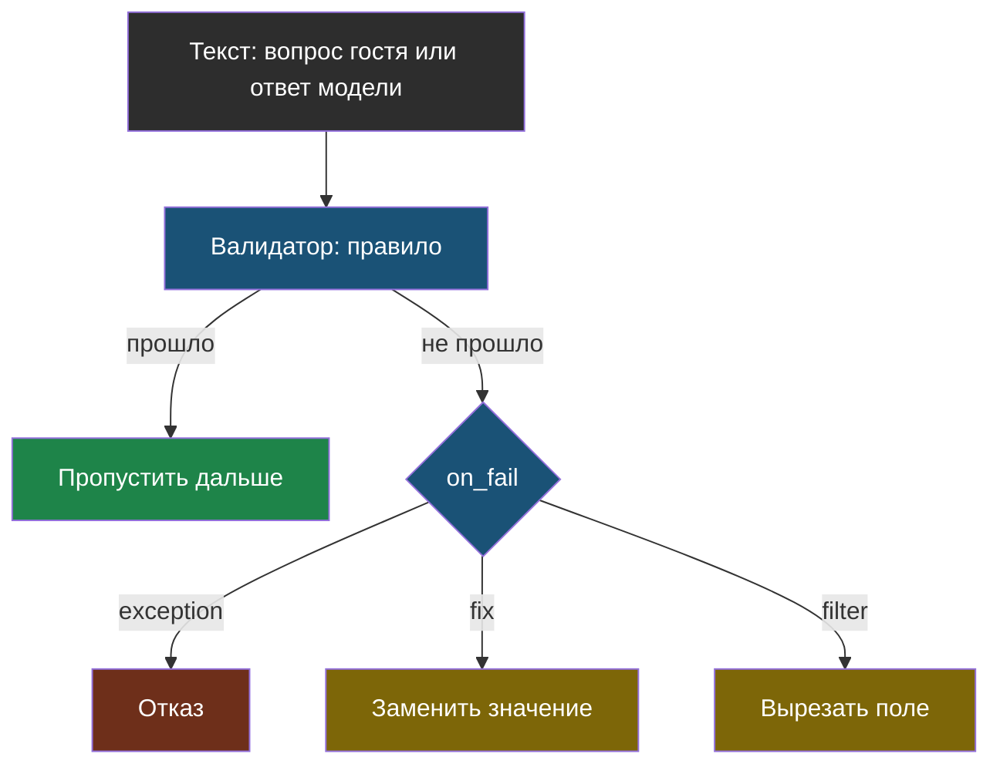
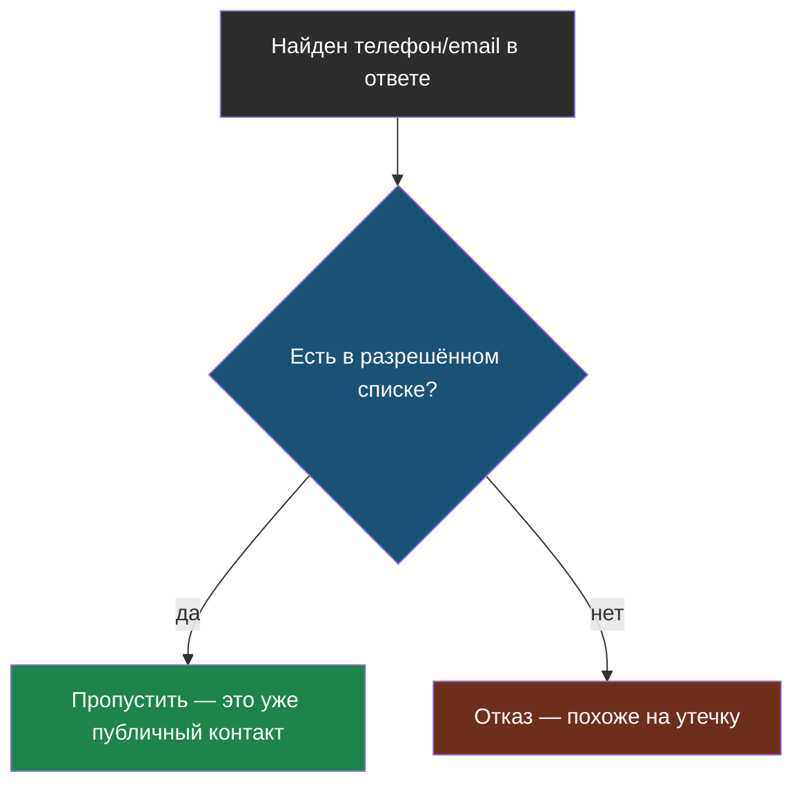

# Словарик модуля 10

Термины по алфавиту; названия латиницей — в конце.

## Валидатор

> **Валидатор** (в терминах Guardrails) — код, который проверяет текст по
> правилу и решает: пропустить, поправить или отказать.

Из [урока 1](chapter-01.md). Свой валидатор пишется так же, как обычная
функция-проверка — библиотека даёт готовый словарь стратегий (`on_fail`) и
единый способ подключения к пайплайну.

## Разрешённый список (allowlist)

> **Разрешённый список** — набор значений, которые проверка пропускает
> заведомо, до применения общего правила.

Из [урока 2](chapter-02.md). Без него проверка «похоже на телефон»
блокирует и уже опубликованные, законные контакты компании — не только
случайную утечку.

